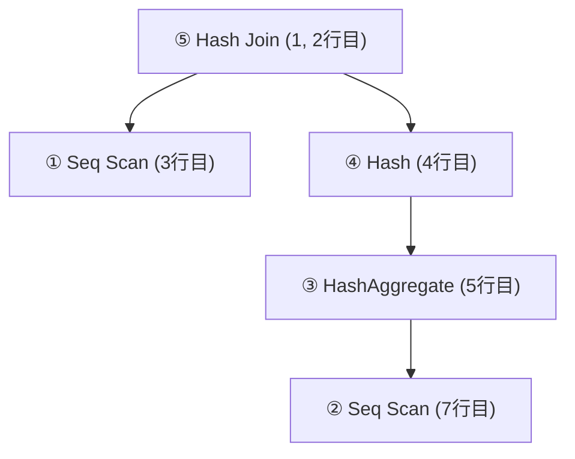
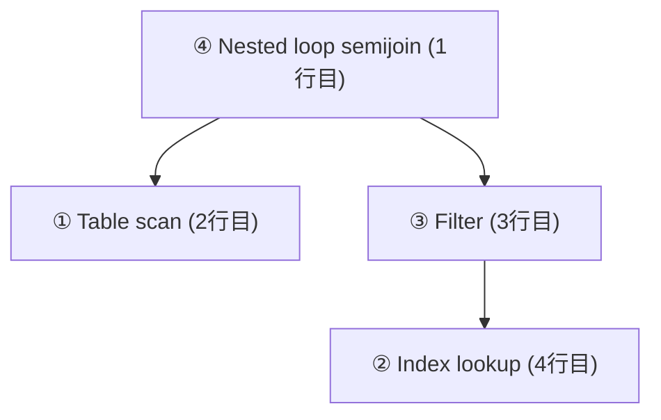

:::message
本記事で扱う RDBMS は MySQL と PostgreSQL のみです．
:::

# はじめに
Laravel Eloquent には `whereHas()` というメソッドがあります．このメソッドは，リレーション先のテーブルを検索条件に含めたい時に活用できるものです．

例を示します．

今，Author モデルと Book モデルが hasMany の関係（1：他 の関係）で定義されているとします．

```php:Author.php
use Illuminate\Database\Eloquent\Model;
use Illuminate\Database\Eloquent\Relations\HasMany;

/**
 * @property int    $id   PK
 * @property string $name 氏名
 */
class Author extends Model
{
    public function books(): HasMany
    {
        return $this->hasMany(Book::class);
    }
}
```

```php:Book.php
use Illuminate\Database\Eloquent\Model;
use Illuminate\Database\Eloquent\Relations\BelongsTo;

/**
 * @property int             $id           PK
 * @property string          $title        タイトル
 * @property int             $author_id    著者 ID
 * @property CarbonImmutable $published_at 出版日
 */
class Book extends Model
{
    public function author(): BelongsTo
    {
        return $this->belongsTo(Author::class);
    }
}
```

このとき，出版日が 2000-01-01 以降の書籍を書いたことのある著者一覧を取得したい場合，以下のように書くことができます．

```php
use App\Models\Author;
use Carbon\Carbon;
use Illuminate\Contracts\Database\Query\Builder;

$users = Author::query()
    ->whereHas('books', function (Builder $query) {
        $query->where('published_at', '>', Carbon::parse('2000-01-01'));
    })
    ->get();
```

このように，`whereHas()` を使うことで，対象のモデルに紐づく別のモデルに対して条件を付与して検索クエリを発行することができます．

今回は，この `whereHas()` のお話です．

# 遅いと言われた whereHas()
さて，`whereHas()` メソッドはこのように非常に便利なメソッドですが，これまでは割と避けられがちなメソッドでした．

検索エンジンで [Laravel whereHas] と検索すると，「whereHas は重い・遅いので注意しましょう」と書かれているような記事が割と出てきます．

遅いと言われている理由については，既にいろんな記事として世に出ているため詳しくは割愛しますが，簡単に言うと `whereHas()` を使ったときクエリビルダが吐くクエリが **相関サブクエリ** になっているからです．

実際に実行されるクエリをダンプしてみると，以下のようになっています（整形済み）．

```sql
SELECT *
FROM "authors"
WHERE EXISTS (
    SELECT *
    FROM "books"
    WHERE "authors"."id" = "books"."author_id"
        AND "published_at" > '2022-01-01 00:00:00'
);
```

クエリを見ると，`WHERE "authors"."id" = "books"."author_id"` の部分が相関になっていることがわかります．`authors` テーブルの一行毎に，where 句の中のサブクエリが実行されることになり，パフォーマンスが落ちるというわけです．

# そもそも PostgreSQL では遅くなかった
実は，この問題が起こるのは MySQL のみで，PostgreSQL の場合は遅くなることはありませんでした．なぜなら，PostgreSQL ではオプティマイザがクエリを最適化してくれるためです．

実際に PostgreSQL ではどのような実行計画になっているのか，`EXPLAIN` 文を使って覗いてみます．

```sql:実行計画(PostgreSQL 14.4)
explain select * from "authors" where exists (select * from "books" where "authors"."id" = "books"."author_id" and "published_at" > '2022-01-01 00:00:00');

                                           QUERY PLAN
-------------------------------------------------------------------------------------------------
 Hash Join  (cost=28.25..58.26 rows=357 width=36)
   Hash Cond: (authors.id = books.author_id)
   ->  Seq Scan on authors  (cost=0.00..22.70 rows=1270 width=36)
   ->  Hash  (cost=26.04..26.04 rows=177 width=4)
         ->  HashAggregate  (cost=24.27..26.04 rows=177 width=4)
               Group Key: books.author_id
               ->  Seq Scan on books  (cost=0.00..23.38 rows=357 width=4)
                     Filter: (published_at > '2022-01-01 00:00:00'::timestamp without time zone)
```

PostgreSQL の実行計画は木構造になっています．上記の実行計画を簡単に樹形図に書き起こすと次のようになります．（先頭の数字は実行順）

:::message
PostgreSQL の実行計画は，次のようなルールに従って順番に実行されます．
* ネストが深いところから実行していく
* 兄弟要素がある場合，先に記述されている方を優先する

要約すると，葉が並んでいた場合先に書かれた葉が優先される深さ優先探索（DFS）と言えます．
:::



今回は，`Seq Scan`, `HashAggregate`, `Hash`, `Hash Join` の4種類の演算子が出てきました．
それぞれの意味を簡単に解説します．

### Seq Scan 演算子
* 単純に表を頭から順番に見ていく（スキャンする）
* 条件に関わらず各行をチェックする

### HashAggregate 演算子
* GROUP BY の高速処理ルーチン
* ハッシュ表を使ってレコードをグルーピングする
* 必要とするメモリが比較的多め

### Hash と Hash Join  演算子
* Hash と Hash Join はセットで出てくる
* Hash は，Hash Join 演算子で使用されるハッシュ表を作成する
* 内側のテーブルのハッシュ表を作成し，外側のテーブルとハッシュ表を突き合わせてテーブル同士を結合する


以上を踏まえて，実際に PostgreSQL がどのように処理を実行しているのかを整理すると，（番号は樹形図と対応している）
1. authors テーブルをフルスキャンする
2. books  テーブルを条件付きでフルスキャンする
    * `published_at > '2022-01-01 00:00:00'::timestamp without time zone` をフィルターとする
3. 一時的にハッシュ表を作成し，books テーブルを `author_id` でグルーピングする
4. 3 グルーピングした books テーブルからハッシュ表を作成する
5. 4 で作成したハッシュ表からを使って authors テーブルと books テーブルを結合する

これを見ても，「行毎にサブクエリが実行される」という処理は走っていないことが分かります．

# MySQL だとどうか？
結論から言うと，**MySQL 8.0.16 から相関サブクエリの最適化が入った** ので，それ以降のバージョンであれば，PostgreSQL と同様パフォーマンスは落ちません．

https://dev.mysql.com/doc/refman/8.0/ja/semijoins.html

とはいえ，せっかく PostgreSQL の実行計画を詳しく見たので，MySQL の方も覗いて見ましょう（変態）.

:::message alert
MySQL のオプティマイザはメジャーバージョンが違うだけでかなり進歩していることがあります．
今回は  MySQL 8.0.16 と 5.7.38 を使用しましたが，筆者が参考にした資料やドキュメントの内容と実際の挙動に差異がある可能性があります．
:::

# MySQL 8.0.16 以前の実行計画
手元に MySQL 5.7.38 の環境を用意できたので，こちらで試してみます．
MySQL も PostgreSQL と同様，実行計画を見るにはクエリ文の前に `EXPLAIN` をくっつけるだけです．

```sql:実行計画(MySQL 5.7.38)
explain select * from authors where exists (select * from books where authors.id = books.author_id and published_at > '2022-01-01 00:00:00');

+----+--------------------+---------+------------+------+---------------+-----------+---------+--------------------+------+----------+-------------+
| id | select_type        | table   | partitions | type | possible_keys | key       | key_len | ref                | rows | filtered | Extra       |
+----+--------------------+---------+------------+------+---------------+-----------+---------+--------------------+------+----------+-------------+
|  1 | PRIMARY            | authors | NULL       | ALL  | NULL          | NULL      | NULL    | NULL               |    1 |   100.00 | Using where |
|  2 | DEPENDENT SUBQUERY | books   | NULL       | ref  | author_id     | author_id | 4       | testing.authors.id |    1 |   100.00 | Using where |
+----+--------------------+---------+------------+------+---------------+-----------+---------+--------------------+------+----------+-------------+
```

PostgreSQL の時とは全然雰囲気の違う実行計画ですね．先程は木構造になって出てきましたが，今回はテーブル形式で出力されました（内部的には，MySQL の実行計画も木構造になっています（後述））．
MySQL の実行計画の読み方については，公式ドキュメントがわかりやすかったので，そのまま引用します．

https://dev.mysql.com/doc/refman/5.6/ja/explain-output.html

### EXPLAIN 出力カラム

| カラム        | 意味                                           |
| ------------- | ---------------------------------------------- |
| id            | SELECT 識別子                                  |
| select_type   | SELECT 型                                      |
| table         | 出力業のテーブル                               |
| partitions    | 一致するパーティション                         |
| type          | 結合型                                         |
| possible_keys | 選択可能なインデックス                         |
| key           | 実際に選択されたインデックス                   |
| key_len       | 選択されたキーの長さ                           |
| ref           | インデックスと比較されるカラム                 |
| rows          | 調査される行の見積もり                         |
| filtered      | テーブル条件によってフィルタ処理される行の割合 |
| Extra         | 追加情報                                       |

### select_type（一部抜粋）

| select_type 値     | 意味                                                   |
| ------------------ | ------------------------------------------------------ |
| SIMPLE             | 単純な SELECT （UNION やサブクエリを使用しない）       |
| PRIMARY            | 最も外側の SELECT                                      |
| DEPENDENT SUBQUERY | サブクエリ内の最初の SELECT で，外側のクエリに依存する |

### type (一部抜粋)
| type 値 | 意味                                                                                    |
| ------- | --------------------------------------------------------------------------------------- |
| ALL     | テーブルフルスキャン                                                                    |
| ref     | PRIMARY もしくは UNIQUE ではないインデックスを使って等価検索（where key = value）を行う |


さて，以上を踏まえて実行計画から実際に行われている処理を整理してみます．

実行計画の `id` がそのままクエリの実行順序になるので，まずは `select_type` が `PRIMARY` の処理が実行されることになります．
`type` が `ALL` になっているので，`authors` テーブルをフルスキャンします．

次に，`select_type` が `DEPENDENT SUBQUERY` の処理が実行されることになります．
`DEPENDENT SUBQUERY` が，まさに相関サブクエリに相当するもので， `select_type` の説明にもあったとおり，外側のクエリに依存しているサブクエリです．今回であれば，外側のクエリは一つ前に処理されている `authors` テーブルのフルスキャンですね．

また，公式ドキュメントには以下のように書いてあります（MySQL 5.7）

> For DEPENDENT SUBQUERY, the subquery is re-evaluated only once for each set of different values of the variables from its outer context.

外部コンテキストからの変数の異なる値の各セット毎に 1 度のみ評価されると書いてあるため，外側のクエリの SELECT 結果の行に対して行われることになります．
今回，`authors` のスキャンについて特に条件は指定していないため，`authors` テーブルの全レコードに対して，サブクエリが評価されることになります．

# MySQL 8.0.16 以降の実行計画
では，MySQL 8.0.16 以降の実行計画はどのようになっているのでしょうか．
手元に MySQL 8.0.31 の環境を用意できたので，こちらで試してみます.

```sql:実行計画(MySQL 8.0.31)
explain select * from authors where exists (select * from books where authors.id = books.author_id and published_at > '2022-01-01 00:00:00');

+----+-------------+---------+------------+------+---------------+-----------+---------+--------------------+------+----------+----------------------------------+
| id | select_type | table   | partitions | type | possible_keys | key       | key_len | ref                | rows | filtered | Extra                            |
+----+-------------+---------+------------+------+---------------+-----------+---------+--------------------+------+----------+----------------------------------+
|  1 | SIMPLE      | authors | NULL       | ALL  | PRIMARY       | NULL      | NULL    | NULL               |    1 |   100.00 | NULL                             |
|  1 | SIMPLE      | books   | NULL       | ref  | author_id     | author_id | 4       | testing.authors.id |    1 |   100.00 | Using where; FirstMatch(authors) |
+----+-------------+---------+------------+------+---------------+-----------+---------+--------------------+------+----------+----------------------------------+
```

実は，MySQL 8.0.16からは `EXPLAIN FORMAT=TREE` という表示形式が追加され，PostgreSQL と同じように木構造で実行計画を表示することができます．(MySQL 8.0.18 で導入された `EXPLAIN ANALYZE` だと常に木構造で表示されます)

```sql:実行計画(MySQL 8.0.31)
explain format=tree select * from authors where exists (select * from books where authors.id = books.author_id and published_at > '2022-01-01 00:00:00');

+------------------------------------------------------------------------------------------------+
| EXPLAIN                                                                                        |
+------------------------------------------------------------------------------------------------+
| -> Nested loop semijoin  (cost=0.70 rows=1)
    -> Table scan on authors  (cost=0.35 rows=1)
    -> Filter: (books.published_at > TIMESTAMP'2022-01-01 00:00:00')  (cost=0.35 rows=1)
        -> Index lookup on books using author_id (author_id=authors.id)  (cost=0.35 rows=1)
|
+------------------------------------------------------------------------------------------------+

```

こちらを樹形図にしてみると以下のようになります．



これを整理すると次のようになります．
1. `authors` テーブルをフルスキャンする
2. 1 の結果の `id` (`authors.id`) を使って，`books` テーブルをインデックス検索する
3. 2 の結果に対して，フィルター処理をかける
    * `books.published_at > TIMESTAMP'2022-01-01 00:00:00'` をフィルターとする
4. 1 の結果と 3 の結果を Nested loop で準結合する

ここで，先程の PostgreSQL では出てこない単語がいくつか出てきました．

### Index lookup
これは単に，作成してあるインデックスを元に検索を行うものです．
今回の場合は，`author_id` に対して外部キー制約を貼っているためインデックスが効いています．

### semijoin (準結合)
テーブルの結合方法の1つで，サブクエリを含む IN，EXISTS 句で出てきます．
準結合は，サブクエリの結果に一致する行が存在する場合に，外側のテーブルから行が返されます．つまり，サブクエリ内のテーブルの重複レコードを取り除き，結合します．

### Nested loop semijoin
一方ののテーブルAから 1 行ずつ取り出し，もう一方のテーブルBのそれぞれの行に突き合わせて，結合条件を満たした場合に，テーブルAの行を取り出すというアルゴリズムです．結合方法は準結合です．
今回の `authors` テーブルのフルスキャン結果と，`books` テーブルのフィルター結果に対して，Nested loop semijoin を PHP のコードで書いてみると，次のようになります
```php
$authors = []; // フルスキャン結果が入っている配列
$books = []; // フィルター結果が入っている配列

$results = []; // まだ空
foreach ($authors as $author) {
    foreach ($books as $book) {
        if ($book['book.authors_id'] === $author['author.id']) {
            $results[] = [...$authors] + [...$book];
            break;
        }
    }
}

```

https://dev.mysql.com/doc/refman/8.0/ja/nested-loop-joins.html

さて，実行計画を見る限り，相関サブクエリにはなっていないことが確認できました．その代わりに，準結合に変換されていましたね．これはオプティマイザの最適化によって実現されていることで，MySQL のドキュメントにも明記されています．

> MySQL 8.0.16 以降では、EXISTS サブクエリー述語を含むステートメントは、同等の IN サブクエリー述語を含むステートメントと同じ準結合変換の対象となります。


https://dev.mysql.com/doc/refman/8.0/ja/semijoins.html

# 代替手段との比較
これまで `whereHas()` で実現できたリレーション先での条件指定による取得処理は，処理が重いという理由で別の方法で代替されていました．その方法を以下に示します．

1. 条件指定したい子テーブルに対してクエリを投げて外部キーを取得する
2. 1 で取得した外部キーを使って親テーブルに対して `whereIn` する

実際に Laravel ではどのように書くのか，その例を示します．

```php
use App\Models\Author;
use Carbon\Carbon;
use Illuminate\Contracts\Database\Query\Builder;

$users = Author::query()
    ->whereIn(
        'authors.id',
        Book::query()
            ->where('published_at', '>', Carbon::parse('2000-01-01'))
            ->select('books.author_id'),
    )
    ->get();

```

`whereIn()` は第 2 引数にサブクエリを取ることができますので，このような書き方をすれば 1 クエリに収めることができます．
また，このクエリビルダが最終的に吐き出す SQL は次の通りです．

```sql
SELECT *
FROM "authors"
WHERE "authors"."id" IN (
    SELECT "books"."author_id"
    FROM   "books"
    WHERE  "published_at" > '2022-01-01 00:00:00'
);
```
それでは，それぞれ実行計画を見てみます．

## Postgres での実行計画

```sql:実行計画(PostgreSQL 14.4)
explain select * from "authors" where "authors"."id" in (select "books"."author_id" from "books" where "published_at" > '2022-01-01 00:00:00');

                                           QUERY PLAN
-------------------------------------------------------------------------------------------------
 Hash Join  (cost=28.25..58.26 rows=357 width=36)
   Hash Cond: (authors.id = books.author_id)
   ->  Seq Scan on authors  (cost=0.00..22.70 rows=1270 width=36)
   ->  Hash  (cost=26.04..26.04 rows=177 width=4)
         ->  HashAggregate  (cost=24.27..26.04 rows=177 width=4)
               Group Key: books.author_id
               ->  Seq Scan on books  (cost=0.00..23.38 rows=357 width=4)
                     Filter: (published_at > '2022-01-01 00:00:00'::timestamp without time zone)
```

`whereHas()` を使ったときと全く同じ実行計画になりました．PostgreSQL が論理的に同じ結果になるクエリについては同じ実行計画になるよう正しく最適化してくれていそうですね．

## MySQL5.7.38 での実行計画

```sql:実行計画(MySQL 5.7.38)
explain select * from authors where authors.id in (select books.author_id from books where published_at > '2022-01-01 00:00:00');
+----+-------------+---------+------------+------+---------------+-----------+---------+--------------------+------+----------+----------------------------------+
| id | select_type | table   | partitions | type | possible_keys | key       | key_len | ref                | rows | filtered | Extra                            |
+----+-------------+---------+------------+------+---------------+-----------+---------+--------------------+------+----------+----------------------------------+
|  1 | SIMPLE      | authors | NULL       | ALL  | PRIMARY       | NULL      | NULL    | NULL               |    1 |   100.00 | NULL                             |
|  1 | SIMPLE      | books   | NULL       | ref  | author_id     | author_id | 4       | testing.authors.id |    1 |   100.00 | Using where; FirstMatch(authors) |
+----+-------------+---------+------------+------+---------------+-----------+---------+--------------------+------+----------+----------------------------------+
```

こちらは，`whereHas()` のクエリを準結合に最適化した MySQL 8.0.31 での実行計画と同じになりました．
これを見る限り，`whereIn()` を使えば相関サブクエリにはならずに，MySQL 8.0.31 や PostgreSQL で `whereHas()` を使った場合と同等のパフォーマンスが出そうです．

## MySQL8.0.31 での実行計画

```sql:実行計画(MySQL 8.0.31)
explain select * from authors where authors.id in (select books.author_id from books where published_at > '2022-01-01 00:00:00');
+----+-------------+---------+------------+------+---------------+-----------+---------+--------------------+------+----------+----------------------------------+
| id | select_type | table   | partitions | type | possible_keys | key       | key_len | ref                | rows | filtered | Extra                            |
+----+-------------+---------+------------+------+---------------+-----------+---------+--------------------+------+----------+----------------------------------+
|  1 | SIMPLE      | authors | NULL       | ALL  | PRIMARY       | NULL      | NULL    | NULL               |    1 |   100.00 | NULL                             |
|  1 | SIMPLE      | books   | NULL       | ref  | author_id     | author_id | 4       | testing.authors.id |    1 |   100.00 | Using where; FirstMatch(authors) |
+----+-------------+---------+------------+------+---------------+-----------+---------+--------------------+------+----------+----------------------------------+
```

```sql:実行計画（MySQL 8.0.31, 木構造表示）
explain format=tree select * from authors where authors.id in (select books.author_id from books where published_at > '2022-01-01 00:00:00');
+----------------------------------------------------------------------------------------+
| EXPLAIN                                                                                                                                                                                                                                                                            |
+----------------------------------------------------------------------------------------+
| -> Nested loop semijoin  (cost=0.70 rows=1)
    -> Table scan on authors  (cost=0.35 rows=1)
    -> Filter: (books.published_at > TIMESTAMP'2022-01-01 00:00:00')  (cost=0.35 rows=1)
        -> Index lookup on books using author_id (author_id=authors.id)  (cost=0.35 rows=1)
|
+----------------------------------------------------------------------------------------+
```

こちらも，`whereHas()` を使ったときと全く同じ実行計画になりました．MySQL 8.0.16 以降であれば PostgreSQL と同様に論理的に同じ結果になるクエリについては同じ実行計画になるよう正しく最適化してくれていそうです．

## 比較した所感
相関サブクエリを普通のサブクエリにすればパフォーマンスが改善することは知識としては知っていましたが，PostgreSQL や 8.0.16 以降の MySQL のオブティマイザが最適化した場合の実行計画と全く同じになることを確認できたときは感動しました．（小並感）
オブティマイザすげぇ〜！

# 全体のまとめ
記事の殆どが `whereHas()` の話ではなく MySQL と PostgreSQL の実行計画の話になってしまいましたが，今回お伝えしたいことは，**`whereHas()` はもう遅くなはいよ！** の一点のみですw

最終的には PostgreSQL も MySQL も，2つのテーブルを結合して条件にあうものをピックアップしている感じに落ち着いているようでした．突合の方法がそれぞれ違っていて面白かったですね．

普段何気なく使っている Laravel のクエリビルダーですが，最終的に吐き出されたクエリが DB 上でどのような手続きによって処理され結果が取得されているのか，実行計画を見てみることで明らかになります．

Eloquent のようなライブラリを使っていると生 SQL を書くことは少なくなってしまいますし，クエリチューニングを本気でやる機会もあまりないかもしれませんが，こうやって実行計画を眺めながらクエリをいじってみたりインデックスの貼り方を工夫してみたりして遊んでみると，意外と時間が溶けていきます（体験談）

お正月休みは Laravel のソースコードか，実行計画を眺めて時間を潰そうと思います🎍．


explain format=tree select * from authors where authors.id in (select books.author_id from books where published_at > '2022-01-01 00:00:00');
