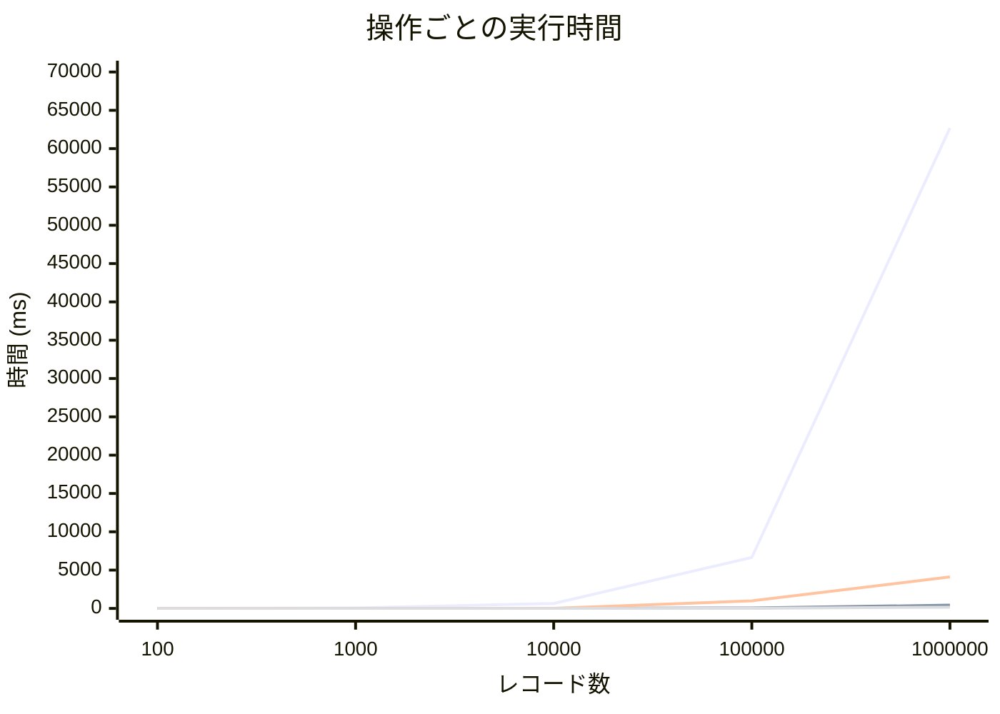

# はじめに

Postgres には JSON/JSONB というデータ型がありますが，JSONB はデータをバイナリ形式で格納するためインサート時に変換のオーバーヘッドがあるものの，その後の処理が非常に高速である上に，インデックスを貼ることができるため，実用上は JSONB を使うのが一般的です．

https://www.postgresql.org/docs/17/datatype-json.html

一方で，そもそも RDB のようなスキーマの厳格な型付けをしているシステムで半構造化データである JSON を扱うこと自体がアンチパターンであるという指摘もあります．

しかしながら，適切に設計，運用することで厳格な RDB で柔軟なデータを扱うことができ，アプリケーションの表現の幅を広げることができます．

本記事では，JSONB を可能な限り安全に扱うための実践的な工夫を紹介します．

# JSON Schema を使ったバリデーションを Check Constraint にする

Postgres では，JSONB に対してスキーマバリデーションを行う機能は提供されていませんが，既存の仕組みと拡張を使って JSON Schema をバリデーションすることができます．

## JSON Schema バリデーションを行う拡張

Postgres で JSON Schema をバリデーションする手段として，以下の２つがあります:

- Postgres の拡張をインストールし，それ使う
- PL/pgSQLでバリデーションロジックを実装する

前者は，自分で拡張をインストールする必要があるため，拡張の選定・検討が必要だったり，Postgres のバージョンアップによっては拡張のアップグレードが必要だったりと，手間がかかるものの，高品質な拡張を選択すれば動作も安心です．
ただし，利用しているレンタルサーバ，DBaaS によっては拡張をインストールすることができないことがあるため注意が必要です．

後者は，Postgres の標準機能のみでバリデーションを行うため，拡張をインストールする必要がなく，ベンダーの制限を受けることがありません．
ただし，バリデーションロジックを自分で実装する必要があるため，バリデーションの仕様が複雑になると，ロジックの実装やメンテナンスが難しくなる上に，品質の保証が難しくなります．

:::message alert

Postgres のドキュメントには，以下のような注意書きがあります．

> PostgreSQL assumes that CHECK constraints' conditions are immutable, that is, they will always give the same result for the same input row. This assumption is what justifies examining CHECK constraints only when rows are inserted or updated, and not at other times. (The warning above about not referencing other table data is really a special case of this restriction.)
>
> An example of a common way to break this assumption is to reference a user-defined function in a CHECK expression, and then change the behavior of that function. PostgreSQL does not disallow that, but it will not notice if there are rows in the table that now violate the CHECK constraint. That would cause a subsequent database dump and restore to fail. The recommended way to handle such a change is to drop the constraint (using ALTER TABLE), adjust the function definition, and re-add the constraint, thereby rechecking it against all table rows.

つまり，JSON のバリデーションロジックを自分で定義する場合，あとからロジックにバグがあって修正しても，その修正が反映されないことがあるため，注意が必要です．
修正が必要な場合は，一度 Check 制約を削除してから，修正したロジックを適用してから再度 Check 制約を適用する必要があります．

:::

## 本記事での選定

本記事では，前者の拡張を利用する方法を取り，`supabase/pg_jsonschema` を使うことにします．

https://github.com/supabase/pg_jsonschema

動作検証のため，上記の拡張を導入した Postgres 16 用の Docker 環境を用意しました．

https://github.com/fuwasegu/pgsql-json-schema-validation-docker

### PL/pgSQL を使う場合

実際自分が参画しているプロジェクトで，PL/pgSQL を使って実装した関数で JSON Schema バリデーションを行っています．

その際に利用したスクリプトは，以下のリポジトリのものを参考にさせていただきました

https://github.com/gavinwahl/postgres-json-schema

ただし，このスクリプトは **JSON Schema Draft v4 Spec まで**の対応で，少々古いため注意が必要です．

### `supabase/pg_jsonschema` について

`supabase/pg_jsonschema` は JSON/JSONB 型に対して JSON Schema バリデーションを行うための拡張です．
この拡張はいくつかの関数を提供しますが，本記事で使うのは `jsonb_matches_schema()` 関数です．

```sql
jsonb_matches_schema(schema json, instance jsonb) returns bool
```

見てわかる通り，`jsonb_matches_schema()` 関数は JSON Schema と検証対象の JSONB を引数に取り，検証対象の JSONB が JSON Schema にマッチするかどうかを返す関数です．

## シンプルな Check 制約

まずは以下のようなテーブルを定義します．

```sql
create table users (
    id serial primary key,
    name text not null,
    roles jsonb,

    constraint users_roles_chk check(jsonb_matches_schema(
        '{
            "type": "array",
            "items": {
                "type": "string"
            },
            "minItems": 1,
            "uniqueItems": true
        }',
        roles
    ))
);
```

Postgres の Check 制約はカラムに対して条件式設定するもので，`jsonb_matches_schema()` は bool 値を返却するため `check(jsonb_matches_schema(...), {column})` と書くことができます．

https://www.postgresql.jp/document/16/html/ddl-constraints.html

これで，実際にデータをインサートしてみて，Check 制約が有効になっているかを確認してみます．

### チェックが通るパターン

```sql
insert into users(name, roles)
values ('Fuwasegu', '["admin", "article_editor"]');

Query 1 OK: INSERT 0 1, 1 row affected
```

### チェックが通らないパターン

`minItems: 1` に違反している

```sql
insert into users(name, roles)
values ('Yametaro', '[]');

Query 1 ERROR at Line 1: : ERROR:  new row for relation "users" violates check constraint "users_roles_chk"
DETAIL:  Failing row contains (2, Yametaro, []).
```

`items.type: string` に違反している

```sql
insert into users(name, roles)
values ('Yametaro', '[1, 2, 3]');

Query 1 ERROR at Line 1: : ERROR:  new row for relation "users" violates check constraint "users_roles_chk"
DETAIL:  Failing row contains (3, Yametaro, [1, 2, 3]).
```

このように，`jsonb_matches_schema()` + Check 制約 を用いることで，レコードのインサート時に JSON のスキーマチェックができるようになりました．

## 複雑な Check 制約

さて，これだけでも十分 JSONB を安全に扱う仕組みが整いましたが，実際のアプリケーションだともう少し凝ったことがしたくなるかも知れません．

### 仮想の要件

今回，仮想の要件として，ショッピングサイトを考えます．
このショッピングサイトでは，

- 家電
- 本
- 衣類

をカテゴリとして扱うことにします．

そこで，以下のような `products` テーブルを考えます

```sql
create table products (
    id uuid primary key default gen_random_uuid() not null,
    name text not null, -- 商品名
    category text not null, -- 商品カテゴリ
    price integer not null,-- 金額
    detail jsonb not null -- 商品詳細
);
```

今回，商品詳細として JSON データを格納することにしました．
この要件では，`detail` のスキーマは `category` によって変わります．

#### 家電の商品詳細

:::details 例

```json
{
    "brand": "Sony",
    "specifications": {
        "voltage": "100V",
        "power_consumption": "1500W"
    },
    "warranty_period": "1 year",
    "dimensions": {
        "width": 30,
        "height": 20,
        "depth": 10
    },
    "features": ["Bluetooth", "Wi-Fi", "USB"]
}
```

:::

:::details JSON Schema

```json
{
    "$schema":  "http://json-schema.org/draft-07/schema#",
    "type": "object",
    "properties": {
        "brand": {
            "type": "string",
            "description": "ブランド"
        },
        "specifications": {
            "type": "object",
            "description": "仕様",
            "properties": {
                "voltage": {
                    "type": "string",
                    "description": "電圧",
                    "pattern": "^[0-9]+V$"
                },
                "power_consumption": {
                    "type": "string",
                    "description": "消費電力",
                    "pattern": "^[0-9]+W$"
                }
            },
            "additionalProperties": false,
            "required": ["voltage", "power_consumption"]
        },
        "warranty_period": {
            "type": "string",
            "description": "保証期間"
        },
        "dimensions": {
            "type": "object",
            "description": "寸法",
            "properties": {
                "width": {
                    "type": "number",
                    "description": "幅"
                },
                "height": {
                    "type": "number",
                    "description": "高さ"
                },
                "depth": {
                    "type": "number",
                    "description": "奥行き"
                }
            },
            "additionalProperties": false,
            "required": ["width", "height", "depth"]
        },
        "features": {
            "type": "array",
            "description": "機能",
            "items": {
                "type": "string",
                "minLength": 0
            }
        }
    },
    "additionalProperties": false,
    "required": ["brand", "specifications", "warranty_period", "dimensions", "features"]
}
```

:::

#### 本の商品詳細

:::details 例

```json
{
    "author": "Taro Yamada",
    "publisher": "Gakken",
    "publication_date": "2022-01-01",
    "page_count": 450,
    "language": "Japanese",
    "genre": "Novel",
    "chapters": [
        {
            "title": "Chapter 1",
            "start_page": 1,
            "end_page": 50
        },
        {
            "title": "Chapter 2",
            "start_page": 51,
            "end_page": 100
        }
    ]
}
```

:::

:::details JSON Schema

```json
{
    "$schema": "http://json-schema.org/draft-07/schema#",
    "type": "object",
    "properties": {
        "author": {
            "type": "string",
            "description": "著者"
        },
        "publisher": {
            "type": "string",
            "description": "出版社"
        },
        "publication_date": {
            "type": "string",
            "description": "出版日",
            "pattern": "^[0-9]{4}-[0-9]{2}-[0-9]{2}$"
        },
        "page_count": {
            "type": "integer",
            "description": "ページ数"
        },
        "language": {
            "type": "string",
            "description": "言語",
            "enum": ["Japanese", "English", "Chinese", "Korean"]
        },
        "genre": {
            "type": "string",
            "description": "ジャンル"
        },
        "chapters": {
            "type": "array",
            "description": "章",
            "items": {
                "type": "object",
                "properties": {
                    "title": {
                        "type": "string",
                        "description": "タイトル"
                    },
                    "start_page": {
                        "type": "integer",
                        "description": "開始ページ"
                    },
                    "end_page": {
                        "type": "integer",
                        "description": "終了ページ"
                    }
                },
                "additionalProperties": false
            },
            "minItems": 1,
            "additionalItems": false
        }
    },
    "additionalProperties": false,
    "required": ["author", "publisher", "publication_date", "page_count", "language", "genre"]
}
```

:::

#### 衣類の商品詳細

:::details 例

```json
{
    "brand": "Nike",
    "size": {
        "type": "M",
        "measurements": {
            "chest": 100,
            "waist": 80,
            "hips": 100
        }
    },
    "color": "Blue",
    "material": {
        "main": "Cotton",
        "lining": "Polyester"
    },
    "washing_instructions": ["Hand washable", "Do not bleach", "Iron low heat"]
}
```

:::

:::details JSON Schema

```json
{
    "$schema": "http://json-schema.org/draft-07/schema#",
    "type": "object",
    "properties": {
        "brand": {
            "type": "string",
            "description": "ブランド"
        },
        "size": {
            "type": "object",
            "description": "サイズ",
            "properties": {
                "type": {
                    "type": "string",
                    "description": "タイプ",
                    "enum": ["XS","S", "M", "L", "XL"]
                },
                "measurements": {
                    "type": "object",
                    "description": "寸法",
                    "properties": {
                        "chest": {
                            "type": "number",
                            "description": "胸囲"
                        },
                        "waist": {
                            "type": "number",
                            "description": "ウエスト"
                        },
                        "hips": {
                            "type": "number",
                            "description": "ヒップ"
                        }
                    },
                    "additionalProperties": false,
                    "required": ["chest", "waist", "hips"]
                }
            },
            "additionalProperties": false,
            "required": ["type", "measurements"]
        },
        "color": {
            "type": "string",
            "description": "色"
        },
        "material": {
            "type": "object",
            "description": "素材",
            "properties": {
                "main": {
                    "type": "string",
                    "description": "メイン素材"
                },
                "lining": {
                    "type": "string",
                    "description": "裏地"
                }
            },
            "additionalProperties": false,
            "required": ["main"]
        },
        "washing_instructions": {
            "type": "array",
            "description": "洗濯方法",
            "items": {
                "type": "string"
            }
        }
    },
    "additionalProperties": false,
    "required": ["brand", "size", "color", "material", "washing_instructions"]
}
```

:::

### 同一カラムに複数の JSON Schema を適用する

同一カラムで複数の JSON Schema を適用する場合，考えられる方法は以下の2つです

- JSON Schema の機能で頑張る
- Check 制約 + CASE 式で頑張る

#### JSON Schema の機能で頑張る

JSON Schema には，`oneOf` という仕組みがあり，これを使うことで複数の JSON Schema を組み合わせることができます．

※ 分量を抑えるために，カテゴリは 本，家電 の2つのみを考えます．

:::details JSON Schema（oneOf を使う）

```json
{
    "$schema": "http://json-schema.org/draft-07/schema#",
    "oneOf":[
        {
            "type":"object",
            "properties":{
                "author":{
                "type":"string"
                },
                "page_count":{
                "type":"integer"
                }
            },
            "required":[
                "author",
                "page_count"
            ]
        },
        {
            "type":"object",
            "properties":{
                "brand":{
                "type":"string"
                },
                "color":{
                "type":"string"
                }
            },
            "required":[
                "brand",
                "color"
            ]
        }
    ]
}
```

:::

ただし，`oneOf` では，`category` によって `detail` のスキーマが変わるようなことは表現できません．

もし，JSON Schema spec が Draft v7 以上であれば，`if then else` を使うことができます．
この場合，JSON 自身に `category` プロパティを追加する必要があるため，テーブルのカラムと情報が重複してしまいます．
したがって，この場合は別途 `category` の内容が一致することをチェックしたほうが良いでしょう．

:::details JSON Schema（if then else を使う）

```json
{
   "$schema":"http://json-schema.org/draft-07/schema#",
   "properties":{
      "category":{
         "type":"string",
         "enum":[
            "book",
            "electronics"
         ]
      }
   },
   "required":[
      "category"
   ],
   "if":{
      "properties":{
         "category":{
            "const":"book"
         }
      }
   },
   "then":{
      "type":"object",
      "properties":{
         "author":{
            "type":"string"
         },
         "page_count":{
            "type":"integer"
         }
      },
      "required":[
         "author",
         "page_count"
      ]
   },
   "else":{
      "if":{
         "properties":{
            "category":{
               "const":"electronics"
            }
         }
      },
      "then":{
         "type":"object",
         "properties":{
            "brand":{
               "type":"string"
            },
            "color":{
               "type":"string"
            }
         },
         "required":[
            "brand",
            "color"
         ]
      }
   }
}
```

:::

これでも同様に，category によって採用する JSON Schema を変えることはできますが，if-then-else は，あくまで `if else` のみで，一般的なプログラミング言語にある `else if` のようなものが存在しないので，並列に分岐を並べたい場合は **then の中に if-then-else を入れ子にする必要があり** 大変読みづらくなります．

#### Check 制約 + CASE 式で頑張る

個人的にはこの記事のメインテーマでもあります．

Postgres には CASE 式というものがあり，これを使うことで Check 制約適用時に JSON Schema を**動的に決定する**ことができます．

https://www.postgresql.jp/document/7.3/user/functions-conditional.html

:::details JSON Schema を動的に決定する

```sql
create table products (
    id uuid primary key default gen_random_uuid() not null,
    name text not null, -- 商品名
    category text not null, -- 商品カテゴリ
    price integer not null,-- 金額
    detail jsonb not null, -- 商品詳細

    constraint products_detail_chk check(jsonb_matches_schema(
        case category
            when 'book' then '{
                "$schema": "http://json-schema.org/draft-07/schema#",
                "type": "object",
                "properties": {
                    "author": {
                        "type": "string"
                    },
                    "page_count": {
                        "type": "integer"
                    }
                },
                "required": ["author", "page_count"]
            }'::json
            when 'electronics' then '{
                "$schema": "http://json-schema.org/draft-07/schema#",
                "type": "object",
                "properties": {
                    "brand": {
                        "type": "string"
                    },
                    "color": {
                        "type": "string"
                    }
                },
                "required": ["brand", "color"]
            }'::json
        end,
        detail
    ))
);
```

:::

ここで，category に予期しない値が入ってきたとき，どのような挙動をするかを考えてみます．

例えば，以下のような INSERT を行ったとします．

```sql
insert into products (name, category, price, detail) values ('Foo', 'foo', 100, '{}');

Query 1 OK: INSERT 0 1, 1 row affected
```

残念ながら，この INSERT はエラーになりません．要件次第ではありますが，多くの場合，このような期待していない入力を受け入れることは避けたいところです．
ここで，まず最初に考えられる対策としては，`category` に対して `enum` 制約を設けることです．

Postgres には列挙型がありますので，これを使って `category` に対して `enum` 制約を設けることができます．

```sql
create type category_enum as enum ('book', 'electronics');

create table products (
    id uuid primary key default gen_random_uuid() not null,
    name text not null,
    category category_enum not null,
    price integer not null,
    detail jsonb not null,

    -- Check 制約は省略
);
```

```sql
insert into products (name, category, price, detail) values ('Foo', 'foo', 100, '{}');

Query 1 ERROR at Line 41: : ERROR:  invalid input value for enum category_enum: "foo"
LINE 1: ...ts (name, category, price, detail) values ('Foo', 'foo', 100...
                                                             ^
```

ただし，プロジェクトによっては Enum を定義したくない場合があるかも知れません（その理由は，検索するといくらでも出てきます）．
その場合は，

- category に対して Check 制約を設ける
  - 実質 Enum と同じような制約
- detail の Check 制約での CASE 式において，予期しない category が来た場合にエラーを返すようにする

の２パターンが考えられます．

まず，category に対して Check 制約を設ける場合は，以下のようになります．

```sql
create table products (
    id uuid primary key default gen_random_uuid() not null,
    name text not null,
    category text not null,
    price integer not null,
    detail jsonb not null,

    constraint products_category_chk check(category in ('book', 'electronics'))
);
```

この場合，`category` に予期しない値が入ってきた場合，エラーになります．

```sql
insert into products (name, category, price, detail) values ('Foo', 'foo', 100, '{}');

Query 1 ERROR at Line 1: : ERROR:  new row for relation "products" violates check constraint "products_category_chk"
DETAIL:  Failing row contains (da811b3f-387f-4652-868e-5ba21d7ec7b7, Foo, foo, 100, {}).
```

次に，detail の Check 制約での CASE 式において，予期しない category が来た場合にエラーを返すようにする場合は，CASE 式と jsonb_matches_schema の順序を入れ替えます．

:::details 予期しない category が来た場合にエラーを返す

```sql
create table products (
    id uuid primary key default gen_random_uuid() not null,
    name text not null,
    category text not null,
    price integer not null,
    detail jsonb not null,

    constraint products_detail_chk check(
        case category
            when 'book' then jsonb_matches_schema('{
                "$schema": "http://json-schema.org/draft-07/schema#",
                "type": "object",
                "properties": {
                    "author": {
                        "type": "string"
                    },
                    "page_count": {
                        "type": "integer"
                    }
                },
                "required": ["author", "page_count"]
            }'::json, detail)
            when 'electronics' then jsonb_matches_schema('{
                "$schema": "http://json-schema.org/draft-07/schema#",
                "type": "object",
                "properties": {
                    "brand": {
                        "type": "string"
                    },
                    "color": {
                        "type": "string"
                    }
                },
                "required": ["brand", "color"]
            }'::json, detail)
            else false
        end
    )
);
```

:::

```sql
insert into products (name, category, price, detail) values ('Foo', 'foo', 100, '{}');

Query 1 ERROR at Line 1: : ERROR:  new row for relation "products" violates check constraint "products_detail_chk"
DETAIL:  Failing row contains (c8517952-0399-42e0-aba7-a5cd488116fc, Foo, foo, 100, {}).
```

これまでは CASE 式が jsonb_matches_schema に渡す JSON Schema を動的に決定する形にしていましたが，この場合は CASE 式が jsonb_matches_schema の結果（true か false）を返す形にしています．
こうすることで，CASE 式の ELSE 節で false を返すと Check 制約がエラーを返すようになります．

ただし，これは本来 category のエラーであるべきものを detail のエラーとして返しているため，本質的ではなくエラーメッセージがわかりづらくなるというデメリットがあります．

### スキーマ変更時のオーバーヘッド

さて，ここまで JSON Schema を用いた柔軟で安全な JSONB 型カラムの定義方法を見てきました．

しかし，実際のユースケースでは最初の Schema 定義後に，スキーマの変更を行うことがあるかもしれません．

例えば，今回取り扱っている products テーブルで言えば，category の追加に伴う新しい details の Schema の追加や，すでにある category の details においてプロパティが追加されたり削除されたりすることが考えられます．

このような場合，一般的な Check 制約の更新方法と同様，以下のような手順を踏むことになります．

1. 変更したい Check 制約を一度削除する
2. 新しい Check 制約を追加する

このとき，新しい Check 制約を追加する際に，既存のデータが新しい Check 制約を満たしていることを保証する必要があります．

これは，すでに登録されているレコード数が多ければ多いほど，チェックに必要な時間が長くなるため，スキーマ変更時のオーバーヘッドが大きくなるという問題があります．

これに対する解決策としては， `NOT VALID` をつけて既存のデータに対する Check 制約のチェックをスキップするという方法があります．この際，あとから `VALIDATE CONSTRAINT` を実行して，既存のデータに対する Check 制約のチェックを行うことが一般的です．

ただし，今回のテーマは JSONB 型カラムを型安全に扱うことであるため，一時的に Check 制約を無効化するという方法は取りません．

本記事では，これ以外の具体的な解決策を提示できませんが，JSONB 型カラムに対して JSON Schema による検証を導入するかどうかを検討する際の一つの指標として，既存レコード数に対するスキーマ変更時の実行時間を何パターンか計測してみます．

#### 検証用テーブル

検証のため，これまでの例として使った Schema よりもう少し複雑な Schema を用意します．

:::details create table

```sql
create table products (
    id uuid primary key default gen_random_uuid() not null,
    name text not null,
    category text not null,
    price integer not null,
    detail jsonb not null,

    constraint products_detail_chk check(
        case category
            when 'book' then jsonb_matches_schema('{
                "$schema": "http://json-schema.org/draft-07/schema#",
                "type": "object",
                "properties": {
                    "author": {
                        "type": "string",
                        "description": "著者"
                    },
                    "publisher": {
                        "type": "string",
                        "description": "出版社"
                    },
                    "publication_date": {
                        "type": "string",
                        "description": "出版日",
                        "pattern": "^[0-9]{4}-[0-9]{2}-[0-9]{2}$"
                    },
                    "page_count": {
                        "type": "integer",
                        "description": "ページ数"
                    },
                    "language": {
                        "type": "string",
                        "description": "言語",
                        "enum": ["Japanese", "English", "Chinese", "Korean"]
                    },
                    "genre": {
                        "type": "string",
                        "description": "ジャンル"
                    },
                    "chapters": {
                        "type": "array",
                        "description": "章",
                        "items": {
                            "type": "object",
                            "properties": {
                                "title": {
                                    "type": "string",
                                    "description": "タイトル"
                                },
                                "start_page": {
                                    "type": "integer",
                                    "description": "開始ページ"
                                },
                                "end_page": {
                                    "type": "integer",
                                    "description": "終了ページ"
                                }
                            },
                            "additionalProperties": false
                        },
                        "minItems": 1,
                        "additionalItems": false
                    }
                },
                "additionalProperties": false,
                "required": ["author", "publisher", "publication_date", "page_count", "language", "genre"]
            }'::json, detail)
            when 'electronics' then jsonb_matches_schema('{
                "$schema": "http://json-schema.org/draft-07/schema#",
                "type": "object",
                "properties": {
                    "brand": {
                        "type": "string",
                        "description": "ブランド"
                    },
                    "specifications": {
                        "type": "object",
                        "description": "仕様",
                        "properties": {
                            "voltage": {
                                "type": "string",
                                "description": "電圧",
                                "pattern": "^[0-9]+V$"
                            },
                            "power_consumption": {
                                "type": "string",
                                "description": "消費電力",
                                "pattern": "^[0-9]+W$"
                            }
                        },
                        "additionalProperties": false,
                        "required": ["voltage", "power_consumption"]
                    },
                    "warranty_period": {
                        "type": "string",
                        "description": "保証期間"
                    },
                    "dimensions": {
                        "type": "object",
                        "description": "寸法",
                        "properties": {
                            "width": {
                                "type": "number",
                                "description": "幅"
                            },
                            "height": {
                                "type": "number",
                                "description": "高さ"
                            },
                            "depth": {
                                "type": "number",
                                "description": "奥行き"
                            }
                        },
                        "additionalProperties": false,
                        "required": ["width", "height", "depth"]
                    },
                    "features": {
                        "type": "array",
                        "description": "機能",
                        "items": {
                            "type": "string",
                            "minLength": 0
                        }
                    }
                },
                "additionalProperties": false,
                "required": ["brand", "specifications", "warranty_period", "dimensions", "features"]
            }'::json, detail)
            else false
        end
    )
);
```

:::

今回は，category に `clothes` を追加するというスキーマ変更を行います．

:::details modify json schema

```sql
begin;

alter table products drop constraint products_detail_chk;

alter table products add constraint products_detail_chk check(
    case category
            when 'book' then jsonb_matches_schema('{
                "$schema": "http://json-schema.org/draft-07/schema#",
                "type": "object",
                "properties": {
                    "author": {
                        "type": "string",
                        "description": "著者"
                    },
                    "publisher": {
                        "type": "string",
                        "description": "出版社"
                    },
                    "publication_date": {
                        "type": "string",
                        "description": "出版日",
                        "pattern": "^[0-9]{4}-[0-9]{2}-[0-9]{2}$"
                    },
                    "page_count": {
                        "type": "integer",
                        "description": "ページ数"
                    },
                    "language": {
                        "type": "string",
                        "description": "言語",
                        "enum": ["Japanese", "English", "Chinese", "Korean"]
                    },
                    "genre": {
                        "type": "string",
                        "description": "ジャンル"
                    },
                    "chapters": {
                        "type": "array",
                        "description": "章",
                        "items": {
                            "type": "object",
                            "properties": {
                                "title": {
                                    "type": "string",
                                    "description": "タイトル"
                                },
                                "start_page": {
                                    "type": "integer",
                                    "description": "開始ページ"
                                },
                                "end_page": {
                                    "type": "integer",
                                    "description": "終了ページ"
                                }
                            },
                            "additionalProperties": false
                        },
                        "minItems": 1,
                        "additionalItems": false
                    }
                },
                "additionalProperties": false,
                "required": ["author", "publisher", "publication_date", "page_count", "language", "genre"]
            }'::json, detail)
            when 'electronics' then jsonb_matches_schema('{
                "$schema": "http://json-schema.org/draft-07/schema#",
                "type": "object",
                "properties": {
                    "brand": {
                        "type": "string",
                        "description": "ブランド"
                    },
                    "specifications": {
                        "type": "object",
                        "description": "仕様",
                        "properties": {
                            "voltage": {
                                "type": "string",
                                "description": "電圧",
                                "pattern": "^[0-9]+V$"
                            },
                            "power_consumption": {
                                "type": "string",
                                "description": "消費電力",
                                "pattern": "^[0-9]+W$"
                            }
                        },
                        "additionalProperties": false,
                        "required": ["voltage", "power_consumption"]
                    },
                    "warranty_period": {
                        "type": "string",
                        "description": "保証期間"
                    },
                    "dimensions": {
                        "type": "object",
                        "description": "寸法",
                        "properties": {
                            "width": {
                                "type": "number",
                                "description": "幅"
                            },
                            "height": {
                                "type": "number",
                                "description": "高さ"
                            },
                            "depth": {
                                "type": "number",
                                "description": "奥行き"
                            }
                        },
                        "additionalProperties": false,
                        "required": ["width", "height", "depth"]
                    },
                    "features": {
                        "type": "array",
                        "description": "機能",
                        "items": {
                            "type": "string",
                            "minLength": 0
                        }
                    }
                },
                "additionalProperties": false,
                "required": ["brand", "specifications", "warranty_period", "dimensions", "features"]
            }'::json, detail)
            when 'clothes' then jsonb_matches_schema('{
                "$schema": "http://json-schema.org/draft-07/schema#",
                "type": "object",
                "properties": {
                    "brand": {
                        "type": "string",
                        "description": "ブランド"
                    },
                    "size": {
                        "type": "object",
                        "description": "サイズ",
                        "properties": {
                            "type": {
                                "type": "string",
                                "description": "タイプ",
                                "enum": ["XS","S", "M", "L", "XL"]
                            },
                            "measurements": {
                                "type": "object",
                                "description": "寸法",
                                "properties": {
                                    "chest": {
                                        "type": "number",
                                        "description": "胸囲"
                                    },
                                    "waist": {
                                        "type": "number",
                                        "description": "ウエスト"
                                    },
                                    "hips": {
                                        "type": "number",
                                        "description": "ヒップ"
                                    }
                                },
                                "additionalProperties": false,
                                "required": ["chest", "waist", "hips"]
                            }
                        },
                        "additionalProperties": false,
                        "required": ["type", "measurements"]
                    },
                    "color": {
                        "type": "string",
                        "description": "色"
                    },
                    "material": {
                        "type": "object",
                        "description": "素材",
                        "properties": {
                            "main": {
                                "type": "string",
                                "description": "メイン素材"
                            },
                            "lining": {
                                "type": "string",
                                "description": "裏地"
                            }
                        },
                        "additionalProperties": false,
                        "required": ["main"]
                    },
                    "washing_instructions": {
                        "type": "array",
                        "description": "洗濯方法",
                        "items": {
                            "type": "string"
                        }
                    }
                },
                "additionalProperties": false,
                "required": ["brand", "size", "color", "material", "washing_instructions"]
            }'::json, detail)
            else false
        end
);

commit;
```

:::

ダミーデータを生成するスクリプトを PHP で実装します．

**テーブル作成スクリプト**
:::details create_table.php

```php

<?php

// データベース接続
$pdo = new PDO(
    'pgsql:host=localhost;dbname=testing;port=5432',
    'testing',
    'password',
);

try {
    $pdo->beginTransaction();

    // テーブルがあったら削除する
    $sql = 'DROP TABLE IF EXISTS products;';
    $pdo->exec($sql);

    // JSON Schema を読み込む
    $book = file_get_contents('./schemas/book.json');
    $electronics = file_get_contents('./schemas/electronics.json');
    $clothes = file_get_contents('./schemas/clothes.json');

    // 新しい制約を追加
    $sql = "
        CREATE TABLE products (
            id uuid primary key default gen_random_uuid() not null,
            name text not null,
            category text not null,
            price integer not null,
            detail jsonb not null,

            CONSTRAINT products_detail_chk CHECK (
                CASE category
                    WHEN 'book' THEN jsonb_matches_schema('$book'::json, detail)
                    WHEN 'electronics' THEN jsonb_matches_schema('$electronics'::json, detail)
                    ELSE false
                END
            )
        );
    ";

    $pdo->exec($sql);
    $pdo->commit();
} catch (PDOException $e) {
    $pdo->rollBack();
    echo 'error: ' . $e->getMessage() . "\n";
}

echo "products テーブルを作成しました\n";

```

:::

**任意の件数のダミーデータをインサートするスクリプト**
:::details insert_data.php

```php

<?php

// 指定要素ランダムに選ぶ
function pick_values(array $input, int $count = 3): array
{
    if (count($input) < $count) {
        return $input;
    }

    $randomKeys = array_rand($input, $count);

    if (is_array($randomKeys)) {
        return array_map(fn($key) => $input[$key], $randomKeys);
    }

    return [$input[$randomKeys]];
}

function create_electronics_detail(): array
{
    return [
        'brand' => 'Brand_' . rand(1, 100),
        'specifications' => [
            'voltage' => rand(100, 240) . 'V',
            'power_consumption' => rand(100, 2000) . 'W',
        ],
        'warranty_period' => rand(1, 5) . ' years',
        'dimensions' => [
            'width' => rand(10, 100),
            'height' => rand(10, 100),
            'depth' => rand(10, 100),
        ],
        'features' => pick_values(['AAA', 'BBB', 'CCC', 'DDD', 'EEE', 'FFF', 'GGG'], 3),
    ];
}

function create_book_detail(): array
{
    return [
        'author' => 'Author_' . rand(1, 100),
        'publisher' => 'Publisher_' . rand(1, 100),
        'publication_date' => date('Y-m-d', strtotime('-' . rand(0, 365) . ' days')),
        'page_count' => rand(100, 500),
        'language' => ['Japanese', 'English', 'Chinese', 'Korean'][rand(0, 3)],
        'genre' => 'Genre_' . rand(1, 10),
        'chapters' => [
            [
                'title' => 'Chapter_1',
                'start_page' => 1,
                'end_page' => rand(20, 50)
            ]
        ]
    ];
}

// 件数
$count = $argv[1] ?? 100;

$pdo = new PDO(
    'pgsql:host=localhost;dbname=testing;port=5432',
    'testing',
    'password',
);

echo "$count 件インサート中...\n";
try {
    $pdo->beginTransaction();

    // ランダムなデータを生成して挿入
    for ($i = 0; $i < $count; $i++) { // 任意の行数を指定
        $name = 'Product_' . rand(1, 100000);
        $category = rand(0, 1) ? 'book' : 'electronics';
        $price = rand(1000, 10000);

        if ($category === 'book') {
            $detail = json_encode(create_book_detail());
        } else {
            $detail = json_encode(create_electronics_detail());
        }

        $sql = "INSERT INTO products (name, category, price, detail) VALUES (:name, :category, :price, :detail)";
        $stmt = $pdo->prepare($sql);
        $stmt->execute([
            ':name' => $name,
            ':category' => $category,
            ':price' => $price,
            ':detail' => $detail
        ]);
    }

    $pdo->commit();
} catch (PDOException $e) {
    echo 'Connection failed: ' . $e->getMessage() . "\n";
    $pdo->rollBack();
}
echo "インサート終了\n";

```

:::

**スキーマ変更スクリプト**
:::details modify_schema.php

```php

<?php

// 指定要素ランダムに選ぶ
function pick_values(array $input, int $count = 3): array
{
    if (count($input) < $count) {
        return $input;
    }

    $randomKeys = array_rand($input, $count);

    if (is_array($randomKeys)) {
        return array_map(fn($key) => $input[$key], $randomKeys);
    }

    return [$input[$randomKeys]];
}

function create_clothes_detail(): array
{
    return [
        'brand' => 'Brand_' . rand(1, 100),
        'size' => [
            'type' => ['XS', 'S', 'M', 'L', 'XL'][rand(0, 4)],
            'measurements' => [
                'chest' => rand(80, 120),
                'waist' => rand(60, 100),
                'hips' => rand(80, 120),
            ],
        ],
        'color' => ['Red', 'Blue', 'Green', 'Black', 'White'][rand(0, 4)],
        'material' => [
            'main' => ['Cotton', 'Polyester', 'Wool'][rand(0, 2)],
            'lining' => ['Silk', 'Nylon', 'None'][rand(0, 2)],
        ],
        'washing_instructions' => pick_values(['AAA', 'BBB', 'CCC', 'DDD', 'EEE', 'FFF', 'GGG'], 3),
    ];
}

function insert_clothes(PDO $pdo) {
    $sql = "INSERT INTO products (name, category, price, detail) VALUES ('test', 'clothes', '1000', :detail)";
    $stmt = $pdo->prepare($sql);
    $stmt->execute([
        ':detail' => json_encode(create_clothes_detail()),
    ]);
};

// データベース接続
$pdo = new PDO(
    'pgsql:host=localhost;dbname=testing;port=5432',
    'testing',
    'password',
);

$thrownError = false;

// clothes がエラーになることを検証する
try {
    insert_clothes($pdo);
} catch (PDOException $e) {
    // ここに入れば OK
    $thrownError = true;
    $message = $e->getMessage();

    if (!str_contains($message, 'new row for relation "products" violates check constraint "products_detail_chk"')) {
        // check 制約以外のエラーなのでストップ
        exit();
    }

    echo "ちゃんとスキーマエラーが発生しました\n";
} finally {
    if (!$thrownError) {
        // catch されなかったのでストップ
        exit();
    }
}

// レコード数を確認する
$sql = "SELECT COUNT(*) FROM products";
$stmt = $pdo->query($sql);
$count = $stmt->fetchColumn();
echo "レコード数: $count 行\n";

// スキーマ変更
echo "計測開始 ...\n";
$start = microtime(true);
try {
    $pdo->beginTransaction();

    // 既存の制約を削除
    $pdo->exec("ALTER TABLE products DROP CONSTRAINT products_detail_chk");

    // JSON Schema を読み込む
    $book = file_get_contents('./schemas/book.json');
    $electronics = file_get_contents('./schemas/electronics.json');
    $clothes = file_get_contents('./schemas/clothes.json');

    // 新しい制約を追加
    $sql = "
        ALTER TABLE products ADD CONSTRAINT products_detail_chk CHECK (
            CASE category
                WHEN 'book' THEN jsonb_matches_schema('$book'::json, detail)
                WHEN 'electronics' THEN jsonb_matches_schema('$electronics'::json, detail)
                WHEN 'clothes' THEN jsonb_matches_schema('$clothes'::json, detail)
                ELSE false
            END
        );
    ";

    $pdo->exec($sql);
    $pdo->commit();
} catch (PDOException $e) {
    echo 'error: ' . $e->getMessage() . "\n";
    $pdo->rollBack();
    exit();
}
$end = microtime(true);
$time = ($end - $start) * 1000; // ミリ秒に変換
echo "計測終了: {$time}(ms)\n";


echo "スキーマが変更されました\n";

// alter 後はインサートされる

try {
    $pdo->beginTransaction();
    insert_clothes($pdo);
} catch (PDOException $e) {
    // ここに入ったらダメ
    echo 'error: ' . $e->getMessage() . "\n";
    exit();
}

echo "clothes がインサートできました\n";
$pdo->rollBack();

```

:::

比較のために，JSON Schema 変更以外にも全データに対する操作をいくつか行い，同様に計測しました．

- インデックスの作成
    `price` に対してインデックスを作成

    ```sql
    CREATE INDEX idx_price ON products(price);
    ```

- カラムのデータ型変更
    `price` のデータ型を `bigint` に変更

    ```sql
    ALTER TABLE products ALTER column price TYPE bigint;
    ```

- JSONB 以外のカラムに対する Check 制約の追加
    `category` に `enum` 制約を追加

    ```sql
    ALTER TABLE products ADD CONSTRAINT products_category_chk CHECK (category IN ('book', 'electronics', 'clothes'));
    ```

各検査項目を実行・計測するためのスクリプトは以下の通りです．

:::details other_operations.php

```php
<?php

function measure_time(callable $callable): void
{
    $start = microtime(true);

    $callable();

    $end = microtime(true);
    $time = ($end - $start) * 1000; // ミリ秒に変換
    echo "計測終了: {$time}(ms)\n";
}

// データベース接続
$pdo = new PDO(
    'pgsql:host=localhost;dbname=testing;port=5432',
    'testing',
    'password',
);

// インデックスの作成
echo "インデックスの作成\n";
measure_time(function () use ($pdo) {
    $pdo->beginTransaction();
    $pdo->exec("CREATE INDEX idx_price ON products(price);");
    $pdo->rollBack();
});


// カラムのデータ型を変更
echo "カラムのデータ型を変更\n";
measure_time(function () use ($pdo) {
    $pdo->beginTransaction();
    $pdo->exec("ALTER TABLE products ALTER column price TYPE bigint;");
    $pdo->rollBack();
});

// JSONB 以外のカラムに対する Check 制約の追加
echo "JSONB 以外のカラムに対する Check 制約の追加\n";
measure_time(function () use ($pdo) {
    $pdo->beginTransaction();
    $pdo->exec("ALTER TABLE products ADD CONSTRAINT products_category_chk CHECK (category IN ('book', 'electronics', 'clothes'));");
    $pdo->rollBack();
});

```

:::

以下に，各操作における計測結果を示します．

| 操作 | 100 レコード | 1000 レコード | 10000 レコード | 100000 レコード | 1000000 レコード |
|---|---|---|---|---|---|
| JSON Schema 変更 | 13.31 ms | 72.26 ms | 648.33 ms | 6651.49 ms | 62683.95 ms |
| インデックス作成 | 3.16 ms | 3.50 ms | 6.51 ms | 67.17 ms | 427.62 ms|
| カラムのデータ型変更 | 7.42 ms | 11.26 ms | 16.45 ms | 983.67 ms | 4111.20 ms |
| JSONB 以外のカラムに対する Check 制約の追加 | 0.91 ms | 0.84 ms | 1.87 ms | 14.60 ms | 161.95 ms|



これを見る限り，JSON Schema の変更時のオーバーヘッドは，他の操作に比べてかなり大きいことがわかります．

# まとめ

本記事では，JSONB 型カラムに対して JSON Schema による Check 制約を導入することで，柔軟で安全な JSONB 型カラムの定義方法を検討しました．

また，スキーマ変更時のオーバーヘッドを計測し，JSON Schema 変更時のオーバーヘッドが他の一般的な操作に比べて大きいことが分かりました．

**JSONB x JSON Schema Check は用法・用量を守って正しく使いましょう！**
