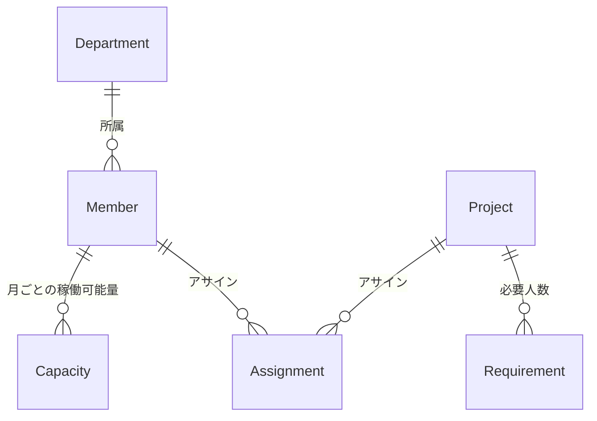
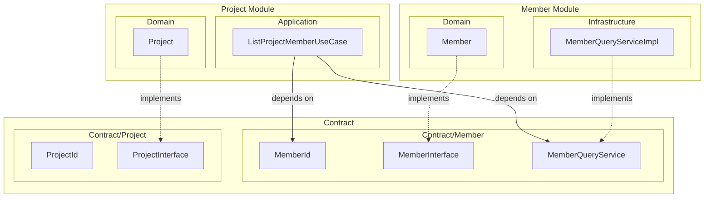
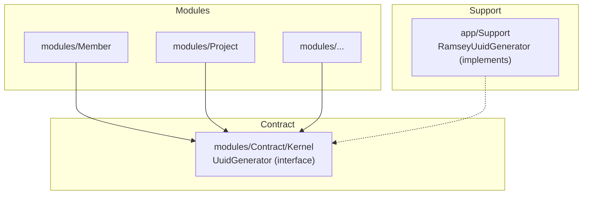

この記事は [Laravel Advent Calendar 2025 - Qiita](https://qiita.com/advent-calendar/2025/laravel) 最終日の記事です．

今年過疎すぎワロタ．


# はじめに

5 年前の Laravel アドベントカレンダー最終日に投稿されたこの記事を皆さんはご存知でしょうか．

https://zenn.dev/mpyw/articles/ce7d09eb6d8117

この記事は Zenn の Laravel トピックで歴代ランキング 1 位をキープし，日本の Laravel コミュニティではおなじみの記事となっています．

Laravel の使いやすさを保ちつつ，できるだけテスタブルで，保守性を高めるためにクリーンアーキテクチャのエッセンスを一部取り込んだ，大変実用性の高いアーキテクチャを提案する価値ある記事です．
僕は 2021 年新卒のときにこの記事を初めて読み，それ以来何度もこの記事に助けられてきました．

また，この記事の著者であり，「なんちゃってクリーンアーキテクチャ」の提唱者である @mpyw 氏は新卒時代から同じチームで働く仲間であり，僕を育ててくれた師匠的存在です．

そんな彼が現在の僕と同い年のときに書いたこの記事に続く形で，Laravel 歴 5 年の僕が「なんちゃってクリーンアーキテクチャ」からさらにステップアップするための記事を Laravel アドベントカレンダーの最終日に投稿してやろうというのが，この記事を書いているモチベーションです．

9 割自己満足，1 割 Laravel コミュニティへの貢献のために，本記事を執筆します．

# なんちゃってクリーンアーキテクチャを振り返る

## ざっくりまとめ

- DDD や ”真の” クリーンアーキテクチャは，大抵の場合オーバースペック
- `app/UseCases` ディレクトリだけ切って，ドメインごとに単一責務なクラスを置くと使いやすい
- ActiveRecord 指向のフレームワークで Repository パターンを無理やり入れると死ぬ
- Eloquent Model は便利で使いたいから UseCase が Eloquent Model に依存することを許容する

## ディレクトリ構成（抜粋）

```
app/
├── Http/
│   ├── Controllers/
│   │   └── PostController.php         # store() メソッド
│   ├── Requests/
│   │   └── Post/
│   │       └── StoreRequest.php        # バリデーション
│   └── Resources/
│       └── PostResource.php            # レスポンス整形
├── Models/
│   ├── User.php
│   ├── Community.php
│   └── Post.php
└── UseCases/
    └── Post/
        ├── StoreAction.php             # ユースケース本体
        └── Exceptions/
            └── PostLimitExceededException.php
```

なんちゃってクリーンアーキテクチャは，ドメインロジックと処理の入口（HTTP なら Controller，CLI なら Console）を分けて，ドメインロジックのテストを書きやすくします．なんでもかんでも Controller や Model に詰め込んで責務が肥大化していく，という問題に対しての良い解決策になっています．

また，厳格なクリーンアーキテクチャに比べファイル数が格段に少なく，学習コストも低いのでプロジェクトに導入しやすいというメリットがあります．

## 所感

僕自身，新人時代に Fat な MVC からなんちゃってクリーンアーキテクチャを使ってリファクタリングした経験もありますし，初学者にも分かりやすいシンプルなアーキテクチャだと思います．
Laravel の機能を殺さずにうまくロジックの整理ができるため，多くの Web 開発現場ではこのアーキテクチャが活躍するのではないでしょうか．そこそこの規模までは耐えうる設計です．

## 2025 年，AI 時代に突入した今思うこと

元記事にも書かれていますが，厳格なクリーンアーキテクチャはオーバースペック気味になりがちなのは僕も理解しています．また，突然ぐっと学習コストが上がる感覚もあります．

でも，5 年前になんちゃってクリーンアーキテクチャを知って実践してきた皆さん，そろそろもう少しガッツリやりたくないですか？扱う関心事が増えてきて，なんちゃってクリーンアーキテクチャでもちょっと辛くなってきてませんか？

当時は学習コストも高かったし，書かなきゃいけないクラスが多くて大変でした．でも今は AI がいます．学習コストも実装コストも，5 年前とは違うんです．

また，責務分割やさらなる細かいレイヤーの整理は，AI にコードを書かせるときにも大変重要になってきていると思います．
AI はコードベース全体をごそっと変えてしまう力がありますが，修正スコープを絞らせるためには，しっかり関心ごとを分離しておくことが大切です．

なんちゃってクリーンアーキテクチャでは，Eloquent Model の共有，UseCase と DB レイヤーの密結合など，取捨選択のなかで妥協されてきた部分があります．
この妥協されてきた部分の改善こそ，AI がコードに手を入れる際適切にスコープを絞る鍵となります．

## 「なんちゃって」の限界

元記事の Q&A にもこのように書かれています．

> **Q7. テーブル正規化されまくってて，超複雑かつ多機能なプロジェクトなんだけど？この案件でこの考え方使っても本当に大丈夫？**
>
> **無理です。潔く Eloquent Model を今すぐ完全に捨てて，本気で DDD やる構えを見せなさい。いくらなんでも適材適所ってものがあるよ！**

つまり，ある規模，複雑さを超えると「なんちゃって」では対応しきれないということです．

具体的に限界が来そうなケースとして，以下のような点が挙げられます．

- モジュール間（ドメイン間）の依存関係が複雑化してきた
- 「この UseCase、どのドメインに属するんだっけ？」問題
- テストが書きづらくなってきた（Eloquent に依存しすぎ）
- 複数チームで開発するようになった（境界が曖昧だと衝突する）

本記事では，これらの問題に対応できる「なんちゃってからステップアップするアーキテクチャ」を紹介します．

# ドメイン間の整理: モジュール分割と Contract

ある程度大きな関心事が複数出てきた場合，「モジュラーモノリス」のように，機能や業務ドメインごとに「モジュール」として分割するとスッキリします．

本記事では，例として「社内の稼働管理システム」という仮想プロジェクトを題材に，設計を整理してみようと思います．

## 想定アプリケーション

以下のようなドメインモデルを考えます



軽く言葉で説明すると，以下のようになります．

- Member は，Department（部署）に所属
- Member は，毎月どれくらい稼働するのか（Capacity）を登録する（アルバイトや時短勤務に対応）
- Member は，Project にアサインされる（Assignment）
- Project には，どういう人がどれくらい欲しいかを設定できる（Requirement）

また，各種データの CRUD 以外に，次のような要件があります

- Project には，案件業務と社内活動の２種類がある
- Member ごと，Department ごとに稼働率を計算したい
- Member ごと，Department ごとに案件業務と社内活動の割合を計算したい
- Member に関して，単純な属性でのフィルターに加えて複雑な条件で検索したい
  - 社内活動が多いメンバー
  - 直近３ヶ月で空きがあるメンバー
- Project に関して，単純な属性でのフィルターに加えて複雑な条件で検索したい
  - アサインが足りてないプロジェクト

## モジュールとは

本記事および今回のアーキテクチャにおける「モジュール」とは，関連するドメインをまとめた「境界」です．

なんちゃってクリーンアーキテクチャでは `app/UseCases/Post/` のようにディレクトリを分けていましたが，これはあくまで「名前」で分けているだけで実際には境界と呼べる厳格さはありません．

モジュール分割では，各モジュールが独立して開発・変更できる単位となり，他のモジュールとは明確なインタフェース（後述する Contract）を通じてのみやりとりします．

この「境界を明示する」ことで以下のようなメリットが得られます：

- **変更の影響範囲が明確になる**: モジュールの内部実装を変えても，Contract を変えなければ他に影響しない
- **静的解析で依存関係の検証がしやすくなる**: deptrac などのツールで依存関係の違反を検出する仕組みを CI に構築できる
- **同時並行した実装がやりやすくなる**: 最初に Contract さえ決めてしまえば，モジュールの実装を並行して進められる．これにより AI Agent を複数プロセス立ち上げて一気に実装させるときに事故が起きづらくなる．（１プロセスは Member の CRUD，１プロセスは Project CRUD を実装させる，のようなイメージ）

### モジュールの種類

#### 基本モジュール（CRUD を持つ）

Member，Project，Assignment のように，**独立したライフサイクル** を持つドメインを管理するモジュール．

- 自身の Entity を作成，更新，削除できる
- 後述する Contract に公開 API（ID，Interface，Service）を持つ
- 他のモジュールからは Contract 経由でのみアクセスされる

#### 複合モジュール（読み取り専用）

ドメイン同士が絡み合った複雑な検索や集計のように，**複数の基本モジュールを横断**して情報を集約するモジュール．

- 読み取り専用（他モジュールの Entity を作成・更新しない）
- 複数モジュールの Contract に依存する
- **自身の Contract を持たない** （他のモジュールから参照されない）

### 新しいモジュールを切る判断基準

すべてのドメインモデルごとにモジュールを分割する必要はありません．
以下のような判断基準でモジュールを切るかどうかを検討します．

#### 独立したライフサイクルを持つか？

- Member の作成・削除と Project の作成・削除は独立している -> 別モジュール
- Capacity は Member と強く結びついている -> Member モジュール内に含める

#### 関心事が独立しているか？

- Member と Project は別の関心事 -> 別モジュール
- Member と Department は近いが，Department は組織構造という別の関心事 -> 分けてもいいかも
- Capacity と Member に強く依存 -> Member モジュール内にあっていいかも

#### ドメインを越境した JOIN が必要か？

- 複数ドメインをまたぐ検索は，各モジュールの QueryService を順番に呼ぶと非効率 -> 読み取り専用の複合モジュールとして切り出し，越境 JOIN を許容する
  - 例: MemberSearch は，稼働が空いてる Member などを検索したいので Member，Assignment を JOIN できると助かる

:::message alert
モジュール境界を越えた JOIN は、依存関係が複雑になり変更の影響範囲が広がります．
ここではパフォーマンスを優先した妥協として、読み取り専用に限定して許容しています．

なんちゃってクリーンアーキテクチャでも，取捨選択の中で厳格なクリーンアーキテクチャでは禁忌とされる形を採用していました．
こういう形の崩し，ときには大事．
:::

## Contract という考え方

Contract は，モジュール間の「公開 API」です．

他のモジュールが参照してよいのは Contract に定義されたものだけ．
逆に言えば，Contract に定義されていないもの（Domain 層の Entity 実装，Infrastructure 層の Repository 実装など）は内部実装として隠蔽されます．

### Laravel Framework 実装に学ぶ

実は，Laravel 自身もこの構造を採用しています

```
vendor/laravel/framework/src/Illuminate/
├── Contracts/           # Interface（公開 API）
│   ├── Cache/
│   │   └── Repository.php
│   ├── Queue/
│   │   └── Queue.php
│   └── ...
├── Cache/               # 実装
│   └── Repository.php
├── Queue/               # 実装
│   └── Queue.php
└── ...
```

- `Illuminate\Contracts\Cache\Repository` → Interface（契約）
- `Illuminate\Cache\Repository` → 実装

最も，Laravel は Facade という仕組みで別途開発者にインタフェースを提供しているので，`Illuminate\Contracts` を直接意識したことがない方も多いかもしれません．

しかし，フレームワーク内部ではこの「Contract と実装の分離」が徹底されており，これにより Cache の実装を Redis から Memcached に差し替えても，アプリケーション側のコードに影響しません．

本記事で紹介するモジュール構造も，この考え方を踏襲しています．
**Contract に定義したものだけが公開 API．それ以外は内部実装として隠蔽される**──これがモジュール分割の核心です．

Contract に関しては Laravel のマニュアルにもページが用意されているのでぜひ読んでみてください．

https://laravel.com/docs/12.x/contracts

### Contract に配置されるもの

| 種類 | 例 | 用途 |
|-----|-----|------|
| **ID（ValueObject）** | `MemberId`, `ProjectId` | 型安全な識別子 |
| **Entity Interface** | `MemberInterface` | Entity の読み取り専用契約 |
| **Service Interface** | `MemberQueryService` | 他モジュールに公開するサービスの契約 |
| **Exception** | `MemberNotFoundException` | ドメイン例外 |
| **Enum** | `ProjectType` | 共有される列挙型 |

### ディレクトリ構造（例）

```
modules/Contract/
├── Kernel/                  # SharedKernel（後述．全モジュール共通）
│   ├── Id/
│   │   └── HasId.php        # ID 用 trait
│   ├── Exception/
│   │   ├── DomainException.php
│   │   └── TechnicalException.php
│   └── Pagination/
│       └── Paginator.php
│
├── Member/                  # Member モジュールの契約
│   ├── Identities/
│   │   └── MemberId.php
│   ├── Entities/
│   │   └── MemberInterface.php
│   ├── Services/
│   │   └── MemberQueryService.php
│   └── Exceptions/
│       └── MemberNotFoundException.php
│
└── Project/                 # Project モジュールの契約
    ├── Identities/
    │   └── ProjectId.php
    ├── Entities/
    │   └── ProjectInterface.php
    └── Enums/
        └── ProjectType.php
```

## 今回のアプリケーションにおけるモジュール分割

以上を踏まえて，今回の想定アプリケーションでは以下のようなモジュール分割にしました．

### モジュール一覧

| モジュール | 種類 | 含まれるドメイン | 備考 |
|-----------|------|-----------------|------|
| Member | 基本 | Member, Capacity | メンバー管理．稼働可能量も一緒に |
| Department | 基本 | Department | 組織構造．Member とは別の関心事 |
| Project | 基本 | Project, Requirement | プロジェクト管理．必要人数も一緒に |
| Assignment | 基本 | Assignment | アサイン管理．Member と Project をつなぐ |
| MemberSearch | 複合 | - | 複雑な条件でメンバーを検索 |
| WorkloadOverview | 複合 | - | 稼働率の集計・可視化 |

### ディレクトリ構造（モジュールレベル）

```
modules/
├── Contract/           # 公開 API
│   ├── Kernel/         # SharedKernel（全モジュール共通）
│   ├── Member/
│   ├── Department/
│   ├── Project/
│   └── Assignment/
│
├── Member/             # 基本モジュール
├── Department/         # 基本モジュール
├── Project/            # 基本モジュール
├── Assignment/         # 基本モジュール
│
├── MemberSearch/       # 複合モジュール（Contract なし）
└── WorkloadOverview/   # 複合モジュール（Contract なし）
```

## 分割されたモジュールと Contract の依存関係のイメージ

後述する４層アーキテクチャの概念も含め，モジュール間の依存を Contract 経由で行うイメージを図式化してみました．



- **実線**: 依存（depends on）
- **点線**: 実装（implements）

ポイントは，

- `ListProjectMemberUseCase` は Project Module 内にある
  - Member の取得だが，関心としては Project 起点のため
- Member の取得がしたいので， `MemberQueryService` に依存している
  - 例えば，入力として ProjectId を受け取り，アサインされている MemberId[] から Member の詳細がほしい，など
- **Contract 経由でのみ他モジュールにアクセス**している

## deptrac を使った静的解析

deptrac は，PHP プロジェクトの依存関係を静的解析するツールです．

https://github.com/deptrac/deptrac

「このレイヤー/モジュールは，このレイヤー/モジュールにのみ依存していいよ」というルールを YAML で定義し，違反があれば検出してくれるスグレモノです．

### 依存関係を静的解析できると何が嬉しいか

#### レビュー負荷の軽減

AI Agent に１機能まるっと実装させられる時代になったので，一度に大量のコードをレビューする必要があります．
生成されたコードが正しい依存関係を守っているか，目視で確認するのは大変です．

deptrac を CI に組み込めば，**依存違反は自動で検出**できるようになります．
レビューで確認する項目が減り，ビジネスロジックのチェックに集中できます．

#### ルールの明文化

「このモジュールはあのモジュールを参照しちゃだめ」というルールが YAML で表現されることで（実際は許可ですが），チーム全員が同じ認識を持てます．
口頭やドキュメントで伝えるより確実ですね．

#### リファクタリングの安心感

モジュール構造を変更するとき，「どこかで依存が壊れてないか」をdeptrac が検出してくれます．

どれだけドキュメントや AI 向けルール（マークダウンのルールなど）で依存関係を明示していても，しれっと別モジュールの**実装**を直接呼び出したり，Entity を new したりしてきます．
これも，deptrac で厳格に縛っておくことで，仮に違反したコードを生成されても，「deptrac 落ちたで．直して」で AI を正しい方向に導けます．

### YAML での設定例

```
deptrac/
├── module.yaml         # モジュール間の依存ルール
└── contract.yaml       # Contract 内部の依存ルール
```

モジュール間の依存と，Contract 内部の依存は関心事が異なるため，設定ファイルを分けておくと管理しやすくなります．

#### モジュール間の依存ルール（例）

:::details deptrac/module.yaml
```yaml
deptrac:
  paths:
    - ./modules

  layers:
    - name: Contract
      collectors:
        - type: directory
          value: modules/Contract/.*
    - name: Member
      collectors:
        - type: directory
          value: modules/Member/.*
    - name: Project
      collectors:
        - type: directory
          value: modules/Project/.*
    - name: Assignment
      collectors:
        - type: directory
          value: modules/Assignment/.*
    - name: MemberSearch
      collectors:
        - type: directory
          value: modules/MemberSearch/.*

  ruleset:
    # Contract は自身のみに依存
    Contract:
      - Contract

    # 基本モジュールは Contract + 自身に依存
    Member:
      - Contract
      - Member
    Project:
      - Contract
      - Project
    Assignment:
      - Contract
      - Assignment

    # 複合モジュールも Contract + 自身に依存
    MemberSearch:
      - Contract
      - MemberSearch
```
:::

##### ポイント

- **自分自身も入れる**: `Member: [Contract, Member]` のように、自身への依存も明示
- **他モジュールの内部実装は参照しない**: Member が Project の内部実装を直接触るのは NG


#### Contract 内部の依存ルール（例）

:::details deptrac/contract.yaml
```yaml
deptrac:
  paths:
    - ./modules/Contract

  layers:
    - name: Kernel
      collectors:
        - type: directory
          value: modules/Contract/Kernel/.*
    - name: Member
      collectors:
        - type: directory
          value: modules/Contract/Member/.*
    - name: Project
      collectors:
        - type: directory
          value: modules/Contract/Project/.*
    - name: Assignment
      collectors:
        - type: directory
          value: modules/Contract/Assignment/.*

  ruleset:
    # Kernel は自身のみ（他に依存しない）
    Kernel:
      - Kernel

    # 各 Contract は Kernel + 自身に依存
    Member:
      - Kernel
      - Member

    # Project は MemberId（managerId など）を参照するので Member に依存
    Project:
      - Kernel
      - Project
      - Member

    # Assignment は Member と Project の ID を参照するので依存を許可
    Assignment:
      - Kernel
      - Assignment
      - Member
      - Project
```
:::

##### ポイント

- **Kernel は他に依存しない**: ドメイン固有の知識は入ってこないはず
- **各 Contract は Kernel に依存**: 汎用的な共通クラスを使う
- **関連エンティティへの依存は明示**: Project が `MemberId`（managerId など）を持つなら Member への依存を許可

# モジュール内の整理: ４層アーキテクチャ

前項では主に「機能」や「関心事」を軸にモジュール分割しました．
しかし，それぞれのモジュールの中がとっ散らかっていては意味がありません．

今回，各モジュールの中を「Presentation」「Domain」「Application」「Infrastructure」の４層アーキテクチャでまとめます．

## なぜ４層か

今回なぜ４層アーキテクチャを採用したのか，なんちゃってクリーンアーキテクチャと比較しながら考えます．

| | なんちゃって | 4層アーキテクチャ |
|---|-------------|------------------|
| **層** | Controller + UseCase + Model | Presentation + Application + Domain + Infrastructure |
| **Eloquent 依存** | UseCase が直接 Eloquent を使う | Infrastructure に閉じ込める |
| **Repository** | なし | Domain に Interface、Infrastructure に実装 |
| **DTO** | なし（Request/Response を直接使う） | Input/Output で型安全に |
| **テスタビリティ** | Eloquent に依存するので DB が必要 | Domain は純粋 PHP、モックしやすい |

なんちゃってクリーンアーキテクチャでは，ビジネスロジックでの Eloquent への依存を許容していました．
これはシンプルさとのトレードオフとして正しい選択だったと思います．

しかし，規模が大きくなってくると

- **UseCase が肥大化**: ドメインバリデーション，永続化，外部 API との通信などが混在する
- **テストが書きづらい**: DB ありきのテストになり都度データの用意が必要だし Feature テストなので実行時間もかさむ
- **ビジネスロジックが Eloquent の変更に影響を受ける**: Model のスコープやリレーションを変えると UseCase も修正・確認が必要になる

４層に分けることで，責務が明確になり，変更の影響範囲が限定的になるしテストも書きやすくなるというメリットがあります．

ただし，元記事でも懸念されていた，「ディレクトリ構成が複雑になったりファイル数が増えたりするため管理が大変になる」という問題は確かに残ります．
でも現代ならその大部分を AI を使って解決できます．ルールをしっかりドキュメント化しておくことで，ほぼすべての実装を AI に任せても，問題ない品質で実装を進められます．（実際，本記事で紹介しているアーキテクチャを採用したプロジェクトでは，９割以上のコードを AI が書いています）

ちなみに，先程なんちゃってクリーンアーキテクチャにおける各層の対応を考えましたが，一般的なクリーンアーキテクチャとでは以下のような対応になると思います．

| 本記事の層 | クリーンアーキテクチャでの対応 |
|-----------|---------------------------|
| Presentation | Interface Adapters (Controllers, Presenters) |
| Application | Use Cases |
| Domain | Entities |
| Infrastructure | Frameworks & Drivers |

## 各層の役割とクラス

４の層には，それぞれ以下のようなクラスが配置されます

| 層 | 配置するクラス | 責務 |
|----|--------------|------|
| **Presentation** | Controller, FormRequest, Assembler | HTTPリクエストの受付・レスポンス整形 |
| **Application** | UseCase(IF), Interactor, Input, Output | ユースケースの実行・調整 |
| **Domain** | Entity, VO, Repository(IF), Policy, Factory | ビジネスルール |
| **Infrastructure** | Repository実装, EloquentModel, ExceptionHandler | 技術的詳細 |

:::message 

ここで言う Domain 層の Factory は，Laravel の機能としての Factory ではなく Entity の生成，復元責務をもつ Factory パターンとしての Factory です．

:::

また，依存の方向は以下のようなルールを定めます

```
Presentation → Application → Domain ← Infrastructure
```

- **Presentation** は Application のみに依存
- **Application** は Domain のみに依存
- **Infrastructure** は Domain の Interface を実装（依存性逆転）
- **Domain** は何にも依存しない（純粋な PHP）

### Presentation 層

HTTP リクエストを受け取り，Application 層に受け渡す入口です．

| クラス | 責務 |
|-------|------|
| **Controller** | ルーティングの終端．UseCase を呼び出し，結果を返す |
| **FormRequest** | バリデーション．Laravel の機能をそのまま使う |
| **Assembler** | FormRequest → Input DTO への変換 |

FormRequest でバリデーション後， `validated()` で配列にしてそのまま UseCase に渡すことも考えましたが，やはり型がついてないと UseCase 側で assert することになるので，型安全な方に倒しました．

Assembler はオプションで，詰め替え責務を Controller に持たせても良いと思います．

また，なんちゃってクリーンアーキテクチャではレスポンスの整形に API Resource を用いることを推奨していました．
UseCase から Controller に Eloquent Model が返ってくるなんちゃってクリーンアーキテクチャでは有効な選択でしたが，Eloquent Model が外に出てこない本アーキテクチャでは採用を見送りました．

API Resource のドキュメントにも書いてありますが，これは Eloquent Model と JSON レスポンスの変換レイヤーとしての位置づけが前提になっているため，今回は後述する UseCase の Output DTO に toArray() を実装する形を取りました．

:::message
Output DTO に toArray() を実装するのは Application 層が HTTP レスポンスを意識している感じがして気になる，という印象を持つ方もいらっしゃるかもしれません．
気になる場合は Presentation 層側に別途 Response 整形用のクラスを作ったり，Controller に整形の責務を追わせたりすると良いと思います．
今回は UseCase が返す DTO は Presentation 層に返すオブジェクト（＝ HTTP レスポンスなり標準出力なり CSV なり，何らかの形で外に出ていく情報）だと割り切っているので，個人的には JSON 変換責務をもたせちゃっても良いかなと思っています．
:::

:::details ProjectController
```php
class ProjectController
{
    public function store(
        StoreProjectRequest $request,
        ProjectInputAssembler $assembler,
        StoreProjectUseCase $useCase,
    ): array {
        $input = $assembler->toStoreInput($request->validated());

        $output = $useCase($input);

        return $output->toArray();
    }
```
:::

:::details StoreProjectRequest
```php
class StoreProjectRequest extends FormRequest
{
    public function rules(): array
    {
        return [
            'name' => ['required', 'string', 'max:255'],
            'client_id' => ['nullable', 'string', 'uuid'],
            'manager_id' => ['required', 'string', 'uuid'],
            'since' => ['required', 'date'],
            'until' => ['required', 'date', 'after:since'],
            'type' => ['required', 'string', Rule::enum(ProjectType::class)],
        ];
    }
}
```
:::

:::details ProjectInputAssembler
```php
class ProjectInputAssembler
{
    public function toStoreInput(array $data): StoreProjectInput
    {
        return new StoreProjectInput(
            name: $data['name'],
            clientId: ClientId::createOrNull($data['client_id'] ?? null),
            managerId: MemberId::create($data['manager_id']),
            since: LocalDate::parse($data['since']),
            until: LocalDate::parse($data['until']),
            type: ProjectType::from($data['type']),
        );
    }
}
```
:::

:::message
`MemberId` や `ProjectType` などの VO は Contract に定義されているため，Presentation 層からも参照できます．
もし Domain 層に定義されていたら，Presentation → Domain の依存違反になります．
:::

### Application 層

ユースケースの実行・調整を担当します．

| クラス | 責務 |
|-------|------|
| **UseCase (Interface)** | ユースケースの契約（テスト時に差し替え可能） |
| **Interactor** | UseCase の実装．Domain を組み合わせてユースケースを実現 |
| **Input** | 入力 DTO．Presentation からの入力を型安全に受け取る |
| **Output / View** | 出力 DTO．Presentation に返すデータ |

Interactor という言葉は聞き馴染みがないかもしれません．
UseCase を Interface として定義し，それを Interactor で実装する形になります．
これは，テスト時に UseCase をモックに差し替えられるため Controller のテスト（Fake Request を通した Form バリデーションのテストなど）をする場合に便利です．

また，Interactor 自身はビジネスロジックは基本持ちません．
ビジネスロジックはあくまで Domain 層にある Entity や Policy などが担い，それを組み合わせてユースケースを実現するのが Application 層の役割です．

私としては，認可もビジネスロジックの一部だと考えているので，認可ロジック（Policy）も Domain 層に置きます．

Interactor の役割（例）
1. Policy で認可チェック
2. Factory で Entity 生成
3. Repository で永続化
4. Output DTO に変換して return

:::details StoreProjectUseCase
```php
interface StoreProjectUseCase
{
    public function __invoke(StoreProjectInput $input): StoreProjectOutput;
}
```
:::

:::details StoreProjectInteractor
```php
class StoreProjectInteractor implements StoreProjectUseCase
{
    public function __construct(
        private ProjectFactory $factory,
        private ProjectRepository $repository,
        private StoreProjectPolicy $policy,
        private Authorizer $authorizer,
    ) {}

    public function __invoke(StoreProjectInput $input): StoreProjectOutput
    {
        $this->authorizer->authorize($this->policy);

        $project = $this->factory->create(
            name: $input->name,
            clientId: $input->clientId,
            managerId: $input->managerId,
            since: $input->since,
            until: $input->until,
            type: $input->type,
        );

        $this->repository->save($project);

        return StoreProjectOutput::fromEntity($project);
    }
}
```
:::

:::message
#### トランザクション境界について

DDD では「集約（Aggregate）」という概念があり，整合性を保つべきオブジェクトのまとまりを指します．
トランザクション境界はこの集約単位で設けるのが原則とされ，Repository は集約に対してのみ提供されるため，結果的に「Repository の境界 ≒ トランザクション境界」となることが多いです．

ただし，**集約と Repository は別概念**です．集約は「整合性の境界」，Repository は「永続化の窓口」であり，境界が一致するのは結果であって定義ではありません．

本アーキテクチャでは，より実践的なアプローチを取ります．
**UseCase（Interactor）でトランザクションを貼る**のを基本とします．

なぜ UseCase か？
UseCase は「ビジネス上の一連の操作」を表す単位です．
「この操作が成功するか失敗するか」を一つのまとまりとして扱うのに最適な粒度であり，トランザクション境界として自然です．
また，複数の Repository を跨ぐ操作でも，UseCase でトランザクションを貼れば一貫性を保てます．

モジュラーモノリスの強みは，マイクロサービスでは難しい整合性の担保が **DB トランザクションで簡単に実現できる**ことです．
せっかくなので，UseCase でどんどんトランザクションを貼っていきましょう．

なお，Laravel は savepoint を使ったネストに対応しているので，Repository 内で防御的にトランザクションを貼っておいても競合しません．

#### 複数 Module を跨いだユースケースの例: Requirement を Assignment で入れ替える

```php
class SwapRequirementToAssignmentInteractor implements SwapRequirementToAssignmentUseCase
{
    public function __construct(
        private TransactionExecutor $transaction,
        private AssignmentFactory $factory,
        private AssignmentRepository $repository,
        private RequirementQueryService $requirementQuery,   // Project Module（参照）
        private RequirementCommandService $requirementCommand, // Project Module（更新）
    ) {}

    public function __invoke(SwapRequirementToAssignmentInput $input): void
    {
        // スロットに対応する Requirement を取得
        $requirements = $this->requirementQuery->findBySlotIds($input->slotIds);

        $this->transaction->execute(function () use ($requirements, $input) {
            // Requirement → Assignment に変換（member_id を充てる）
            $assignments = $requirements->map(
                fn (Requirement $req) => $this->factory->create(
                    year: $req->year,
                    month: $req->month,
                    projectId: $req->projectId,
                    memberId: $input->memberId,
                    workload: $req->workload,
                ),
            );

            // Assignment Module: Bulk Insert
            $this->repository->bulkStore($assignments);

            // Project Module: 該当スロットの Requirement を削除
            $this->requirementCommand->deleteBySlotIds($input->slotIds);
        });
    }
}
```
:::

### Domain 層

ビジネスルールを表現します．ここは極力フレームワークに依存しない純粋な PHP で実装します．

| クラス | 責務 |
|-------|------|
| **Entity** | ドメインオブジェクト．ビジネスルールを持つ |
| **Repository (Interface)** | 永続化の契約．実装は Infrastructure |
| **QueryService (Interface)** | 参照系の契約．複雑な検索や集計を担う |
| **Policy** | 認可ルール．ビジネスルールとしての権限判定 |
| **Factory** | Entity の生成ロジックをカプセル化 |

Factory には２つの役割があります

- `create`: Entity の新規生成．IdGenerator を使って UUID を発行しつつ，渡ってきた属性値で Entity を埋める．
- `reconstruct`: DB から渡ってきた既存のモデルを Entity に復元．ID は決まっているはずなので新規発行はしない

これにより Entity の生成方法が統一され，ID の発行タイミングも明確になります．

#### ID に UUID を使うべき理由

一般的に，ID として採用されるのは (Big)Integer か UUID です．整数型の場合は AutoIncrement として DB に採番をお任せすることがほとんどだと思いますが，Repository パターンを厳格にやろうとする場合，Insert と Update の区別はつけず一つの `save()` というインタフェースで更新することになります．

そうすると，ID が save 前に決まらない AutoIncrement は都合が悪いわけです．

UUID であれば，（超高確率で）衝突を回避しながらアプリケーション側で採番の責務を担うことができます．

また，Entity を生成した時点で ID が確定しているので，戻り値の構築や関連オブジェクトへの ID 引き渡しもスムーズになります．

:::details ProjectFactory
```php
class ProjectFactory
{
    public function __construct(
        private IdGenerator $idGenerator,
    ) {}

    public function create(
        string $name,
        ?ClientId $clientId,
        MemberId $managerId,
        LocalDate $since,
        LocalDate $until,
        ProjectType $type,
    ): Project {
        return new Project(
            id: ProjectId::create($this->idGenerator->generate()),
            name: $name,
            clientId: $clientId,
            managerId: $managerId,
            period: new DateRange($since, $until),
            type: $type,
        );
    }

    public function reconstruct(
        string $id,
        string $name,
        ?string $clientId,
        string $managerId,
        string $since,
        string $until,
        string $type,
    ): Project {
        return new Project(
            id: ProjectId::create($id),
            name: $name,
            clientId: ClientId::createOrNull($clientId),
            managerId: MemberId::create($managerId),
            period: new DateRange(
                LocalDate::parse($since),
                LocalDate::parse($until),
            ),
            type: ProjectType::from($type),
        );
    }
}
```
:::

:::message
#### IdGenerator と App\Support について

前述した Factory は IdGenerator に依存していました．
Laravel では `Str::uuid()` や `Str::uuid7()` を使って UUID を生成することができますが，Domain 層ではできるだけフレームワークに依存したくないという理由，static なヘルパではなく DI したいという理由から本アーキテクチャでは自前で実装しています．

自前実装とは言いつつ，ロジック本体は `ramsey/uuid` を利用します．

https://github.com/ramsey/uuid

`UuidGenerator` の Interface は `Contract/Kernel` に定義し，実装は `App\Support` に置きます．

```
modules/
└── Contract/
    └── Kernel/
        └── Id/
            └── UuidGenerator.php  ← Interface

app/
└── Support/
    └── Id/
        ├── RamseyUuidGenerator.php  ← 本番用実装
        └── FixedUuidGenerator.php   ← テスト用実装（必要であれば）
```

##### なぜ分離するのか？

Contract は「モジュール間の公開 API」であり，純粋な PHP で記述します．
`ramsey/uuid` のような外部ライブラリへの依存は Contract に持ち込みたくありません．

そこで，Interface だけを Contract に定義し，実装は `App\Support`（modules の外）に置きます．
これにより Contract の純粋性を保ちつつ，モジュール横断で実装を共有できます．

##### なぜ Support Module にしないのか？

「modules/Support を作ればいいのでは？」と思うかもしれません．

Module は「ドメイン」を表現する単位です．
UUID 生成のような技術的な共通基盤はドメインではないので，Module として切り出すのは意味的に違和感があります．

また，Module 間の依存は Contract 経由が原則ですが，`App\Support` は全 Module で共有したい「技術的な実装置き場」として（modules の外に）置きます．

ここで言う「共有」とは **各モジュールのコードが `App\Support` の具象クラスに依存する**という意味ではなく，**参照するのはあくまで `Contract/Kernel` の interface だけ**で，`App\Support` の実装は ServiceProvider などの DI 設定（Composition Root）でバインドする，という意図です．

また deptrac は（後述の例のように）`paths` を `./modules` に絞っていれば `App\Support` は解析対象外なので，設定を複雑にせずに運用できます（もし `app/` も解析対象に含めるなら，`App\Support` を共有レイヤーとして定義し，各レイヤーからの依存を明示します）．

依存関係を図にするとこんなイメージです：



```php
// Contract/Kernel/Id/UuidGenerator.php
interface UuidGenerator
{
    public function generate(): string;
}

// App\Support\Id\RamseyUuidGenerator.php
use Ramsey\Uuid\Uuid;

class RamseyUuidGenerator implements UuidGenerator
{
    public function generate(): string
    {
        return Uuid::uuid7()->toString();
    }
}

// App\Support\Id\FixedUuidGenerator.php（テスト用）
class FixedUuidGenerator implements UuidGenerator
{
    public function __construct(
        private string $value = 'test-uuid',
    ) {}

    public function generate(): string
    {
        return $this->value;
    }
}
```

##### UUID v7 を採用

本アーキテクチャでは UUID v7 を採用しています．
バージョン選定の詳細については，以下の記事が参考になります．

https://zenn.dev/mpyw/articles/rdb-ids-and-timestamps-best-practices
:::

### Infrastructure 層

技術的詳細を担当します．主に DB アクセス．このレイヤーはフレームワーク依存を気にしなくて良い部分になります．

| クラス | 責務 |
|-------|------|
| **Repository（実装）** | Domain の Repository Interface を実装 |
| **Eloquent Model** | DB テーブルとのマッピング．クエリビルダの入口として使う |
| **ExceptionHandler** | DB 例外を Domain 例外に変換 |
| **QueryService（実装）** | Domain / Contract の QueryService Interface を実装 |

#### Eloquent Model について

リレーションなど Eloquent Model の便利機能はほとんど使わないのでぶっちゃけ生の QueryBuilder を使っても良いのですが，テーブル名や Connection の一元管理，Cast あたりは便利なのでそのまま使います．

また，同一 Module 内であれば Eloquent のリレーション定義は問題ありません．
Infrastructure 層内で完結するので，レイヤーの依存違反にはなりません．

ただし，**他 Module の Model へのリレーションは NG** です．
Module 境界を越える場合は Contract 経由で QueryService を使います．

#### ExceptionHandler について

Eloquent の例外（`UniqueConstraintViolationException` など）は Infrastructure 層の詳細であり，Application 層に漏らしたくありません．
ExceptionHandler で DomainException に変換して，ドメイン的意味を持たせます．

まず，Contract/Kernel に抽象クラスを用意します．

:::details AbstractDatabaseExceptionHandler
```php
abstract class AbstractDatabaseExceptionHandler
{
    /**
     * 通常のコールバック実行
     * @template T
     * @param callable(): T $callback
     * @return T
     */
    public function perform(callable $callback): mixed
    {
        try {
            return $callback();
        } catch (Throwable $throwable) {
            throw $this->convertOrThrow($throwable);
        }
    }

    /**
     * Generator 対応（LazyCollection 用）
     * @template K of array-key
     * @template V
     * @param callable(): iterable<K, V> $callback
     * @return Generator<K, V>
     */
    public function lazy(callable $callback): Generator
    {
        try {
            yield from $callback();
        } catch (Throwable $throwable) {
            throw $this->convertOrThrow($throwable);
        }
    }

    private function convertOrThrow(Throwable $throwable): Throwable
    {
        // 既に変換済みならそのまま
        if ($throwable instanceof ConnectionException) {
            return $throwable;
        }

        // PDOException なら変換
        if ($throwable instanceof PDOException) {
            return $this->convert($throwable);
        }

        // それ以外はそのまま再送出
        return $throwable;
    }

    /**
     * モジュール固有の ConnectionException に変換
     */
    abstract protected function convert(Throwable $throwable): ConnectionException;
}
```
:::

各モジュールでは，この抽象クラスを継承して `convert()` を実装するだけです．

:::details ProjectDatabaseExceptionHandler
```php
final class ProjectDatabaseExceptionHandler extends AbstractDatabaseExceptionHandler
{
    protected function convert(Throwable $throwable): ConnectionException
    {
        return new ProjectConnectionException(
            $throwable->getMessage(),
            previous: $throwable,
        );
    }
}
```
:::

`lazy()` メソッドがあることで，QueryService で `LazyCollection`（Generator）を返す場合でも例外を適切にハンドリングできます．

Repository では以下のように使います．

:::details ProjectRepository
```php
class ProjectRepository implements ProjectRepositoryInterface
{
    public function __construct(
        private ProjectFactory $factory,
        private ProjectDatabaseExceptionHandler $exceptionHandler,
    ) {}

    public function save(Project $project): void
    {
        $this->exceptionHandler->perform(function () use ($project) {
            ProjectModel::query()->updateOrCreate(
                ['id' => $project->id->unwrap()],
                [
                    'name' => $project->name,
                    'client_id' => $project->clientId?->unwrap(),
                    'manager_id' => $project->managerId->unwrap(),

                    // PostgreSQL だと Range 型を使うべきですが，本記事ではスコープ外とします
                    'since' => $project->period->since,
                    'until' => $project->period->until,

                    'type' => $project->type->value,
                ],
            );
        });
    }

    public function findById(ProjectId $id): Project
    {
        return $this->exceptionHandler->perform(function () use ($id) {
            $model = ProjectModel::query()->findOrFail($id->unwrap());

            return $this->factory->reconstruct(
                id: $model->id,
                name: $model->name,
                clientId: $model->client_id,
                managerId: $model->manager_id,
                since: $model->since,
                until: $model->until,
                type: $model->type,
            );
        });
    }
}
```
:::

### モジュール内最終系

今回は Project モジュールで Store 処理を実装したと仮定した４層アーキテクチャの最終系を以下に示します．

```
modules/Project/
├── ModuleServiceProvider.php
├── Presentation/
│   ├── ProjectController.php
│   ├── StoreProjectRequest.php
│   └── ProjectInputAssembler.php
├── Application/
│   ├── StoreProjectUseCase.php       # Interface
│   ├── StoreProjectInteractor.php    # 実装
│   ├── StoreProjectInput.php
│   └── StoreProjectOutput.php
├── Domain/
│   ├── Project.php                   # Entity
│   ├── ProjectRepository.php         # Interface
│   ├── ProjectFactory.php
│   └── Policies/
│       └── StoreProjectPolicy.php
└── Infrastructure/
    ├── ProjectRepository.php         # 実装
    ├── ProjectDatabaseExceptionHandler.php
    └── Models/
        └── ProjectModel.php          # Eloquent
```

### deptrac を使った静的検査

モジュール分割のときにも登場した deptrac ですが，４層の依存ルールの定義にも使えます．

:::details deptrac/layer.yaml
```yaml
# deptrac/layer.yaml
deptrac:
  paths:
    - ./modules
  exclude_paths:
    - ./modules/Contract
  exclude_files:
    # 任意の階層に出現する test / tests ディレクトリ配下を除外 (大文字小文字無視)
    - '#.*/[Tt]est[s]?/.*#'

  layers:
    - name: Presentation
      collectors:
        - type: directory
          value: modules/.*/Presentation/.*
    - name: Application
      collectors:
        - type: directory
          value: modules/.*/Application/.*
    - name: Domain
      collectors:
        - type: directory
          value: modules/.*/Domain/.*
    - name: Infrastructure
      collectors:
        - type: directory
          value: modules/.*/Infrastructure/.*

  ruleset:
    Presentation:
      - Presentation
      - Application
    Application:
      - Application
      - Domain
    Domain:
      - Domain
    Infrastructure:
      - Infrastructure
      - Domain
```
:::

:::message
**ライブラリやフレームワークの機能も制限できる**

deptrac では外部ライブラリを「レイヤー」として定義し，層ごとに許可するライブラリを制限できます．

#### 例

```yaml
layers:
  # Illuminate Collections: Application 層で許可
  - name: IlluminateCollections
    collectors:
      - type: classNameRegex
        value: '#^Illuminate\\Support\\(Collection|LazyCollection)$#'

  # Brick DateTime: Domain/Application 層で許可
  - name: BrickDateTime
    collectors:
      - type: classNameRegex
        value: '#^Brick\\DateTime\\.+$#'

  # Illuminate Database: Infrastructure 層でのみ許可
  - name: IlluminateDatabase
    collectors:
      - type: classNameRegex
        value: '#^Illuminate\\Database\\.+$#'

ruleset:
  Domain: [ Domain, BrickDateTime ]
  Application: [ Application, Domain, IlluminateCollections, BrickDateTime ]
  Infrastructure: [ Infrastructure, Domain, IlluminateCollections, BrickDateTime, IlluminateDatabase ]
  Presentation: [ Presentation, Application, BrickDateTime ]
```

これにより「Domain 層で Eloquent を使ってしまった」といった事故を静的解析で検出できます．
:::

# 実装 Tips 集

これまでのサンプルコードの中にしれっと出てきた概念や，”後述” で後回しにしてきたオリジナルの仕組みなどを紹介します．
モジュール化や４層アーキテクチャをやる上で特に重要なものをピックアップしています．

## 型安全な ID（HasId トレイト）

ID を `string` のまま扱っていると，異なる概念の ID を取り違える事故が起きます．
例えば `MemberId` と `ProjectId` を間違えて渡してしまっても，型としては同じ `string` なので静的解析で誤りを検出できません．

そこで，ID 専用の Value Object を作り，型で区別できるようにします．

### 実装方針

`mpyw/sharable-value-objects` というライブラリを使います．

https://github.com/mpyw/sharable-value-objects

このライブラリは「同じ値なら同じインスタンスを返す」Flyweight パターンを実現します．
これにより `===` での厳密比較が可能になり，テストやモックの可読性が上がります．

### HasId トレイト

Contract/Kernel に共通トレイトを用意します．

```php
namespace Modules\Contract\Kernel\Id;

use Mpyw\SharableValueObjects\SharableString;

trait HasId
{
    use SharableString;

    public static function create(string $id): static
    {
        return static::acquire($id);  // WeakReference プールから取得
    }

    public static function createOrNull(?string $id): ?static
    {
        return $id !== null ? static::create($id) : null;
    }

    public function unwrap(): string
    {
        return $this->getOriginalValue();
    }
}
```

### ID クラスの定義

各モジュールの Contract で ID クラスを定義します．
`HasId` を use するだけで，追加実装は不要です．

```php
namespace Modules\Contract\Member\Identities;

use Modules\Contract\Kernel\Id\HasId;

final class MemberId
{
    use HasId;
}
```

```php
namespace Modules\Contract\Project\Identities;

use Modules\Contract\Kernel\Id\HasId;

final class ProjectId
{
    use HasId;
}
```

### 使い方

```php
// 生成
$id = MemberId::create('550e8400-e29b-41d4-a716-446655440000');
$nullableId = MemberId::createOrNull($input->managerId);

// 取り出し（DB 保存時など）
$raw = $id->unwrap();

// 比較（同値なら同一インスタンス）
$a = MemberId::create('u_1');
$b = MemberId::create('u_1');
assert($a === $b);  // true
```

### アンチパターン

```php
// ❌ __toString() の実装は禁止（暗黙変換の事故を防ぐ）
final class MemberId {
    use HasId;
    public function __toString(): string { ... }  // NG!!
}

// ❌ new 直呼びは禁止（create 経由のみ）
$id = new MemberId('xxx');  // NG!!
```

そもそも SharableString トレイトがコンストラクタを private にするので new できないですが念の為．
なぜ直接 new させたくないかというと，WeakReference プールを経由しないからですね．これはライブラリの実装を読むと意味がわかると思います．

:::message
**バリデーションについて**

HasId ではフォーマット検証（UUID 形式など）を行いません．
Contract には「ロジックを持ち込まない」という方針のためです．

形式検証が必要な場合は，Presentation 層の FormRequest や Application 層で行います．
:::

## トランザクションの抽象化

4 層アーキテクチャのセクションでも触れましたが，トランザクション管理について補足します．

### DDD 的見解と本アーキテクチャの方針

DDD では，トランザクション境界は「集約（Aggregate）」単位で設けるのが原則です．
集約とは整合性を保つべきオブジェクトのまとまりであり，Repository は集約に対してのみ提供されます．

しかし，**集約と Repository は別概念**です．
集約は「ドメインルールに基づく整合性の境界」，Repository は「永続化の窓口」であり，境界が一致するのは結果であって定義ではありません．

本アーキテクチャでは，より実践的に **UseCase（Interactor）でトランザクションを貼る**方針を取ります．

### なぜ抽象化するのか

- ユースケース全体をトランザクション境界にしたい
- 複数の Repository を跨いで整合性を取りたいケースがある（例：Requirement を削除して Assignment を作成）
- Laravel 依存を Contract 層へ漏らさない

### 契約（Contract/Kernel）

```php
namespace Modules\Contract\Kernel\Persistence;

interface TransactionExecutor
{
    /**
     * @template T
     * @param callable(): T $callback
     * @return T
     */
    public function execute(callable $callback): mixed;
}
```

### 実装（App\Support）

```php
namespace App\Support\Persistence;

use Illuminate\Database\ConnectionInterface;
use Modules\Contract\Kernel\Persistence\TransactionExecutor;

class LaravelTransactionExecutor implements TransactionExecutor
{
    public function __construct(
        private ConnectionInterface $connection,
    ) {}

    public function execute(callable $callback): mixed
    {
        return $this->connection->transaction($callback);
    }
}
```

Laravel 標準のネスト処理・リトライ・例外変換に任せ，独自実装は避けます．

### ユースケースでの適用

書き込み系 Interactor では原則として `TransactionExecutor` を注入し，処理全体を `execute()` でラップします．

```php
public function __invoke(StoreMemberInput $input): StoreMemberOutput
{
    return $this->transactions->execute(function () use ($input): StoreMemberOutput {
        $member = $this->factory->create(...);
        $this->repository->save($member);

        return StoreMemberOutput::fromEntity($member);
    });
}
```

:::message
**1 テーブル 1 レコードでも必要？**

単純な更新は DB が暗黙トランザクションを保証するため必須ではありません．
しかし，以下の理由から Interactor 側で境界を設けるメリットがあります：

- Infrastructure 実装が将来複数 SQL に拡張される可能性がある
- 副作用の境界を明示でき，コードリーディング時に意図が伝わる
:::

### Repository でも防御的に貼っておくと安心

UseCase で貼るのが基本ですが，Repository 内で複数テーブルを更新する場合は，防御的に貼っておくと安心です．

```php
// Repository 内でトランザクションを貼る例
public function save(Member $member): void
{
    $this->transactions->execute(function () use ($member) {
        MemberModel::query()->updateOrCreate(...);
        HistoryModel::query()->create(...);  // 履歴も一緒に保存
    });
}
```

### ネストしたトランザクション

Laravel は内部的にカウンタを管理し，最外周のみ commit します．
UseCase と Repository の両方でトランザクションを貼っても問題ありません．

```
UseCase: BEGIN (カウント=1)
  └─ Repository: BEGIN (カウント=2, savepoint)
     └─ INSERT ...
  └─ Repository: COMMIT (カウント=1, savepoint解放)
UseCase: COMMIT (カウント=0, 実際のCOMMIT)
```

この仕組みのおかげで，UseCase では「ユースケース全体の整合性」を担保し，Repository では「自分の責務で必要なトランザクション」を防御的に貼る，という安心設計ができます．

### テスト時のフェイク

```php
namespace Tests\Support\Persistence;

class InMemoryTransactionExecutor implements TransactionExecutor
{
    public function execute(callable $callback): mixed
    {
        return $callback();  // 即時実行するだけ
    }
}
```

Unit テストではこのフェイクを使うことで，高速で安定したテストが書けます．

## 例外設計

Infrastructure 層のセクションで `DatabaseExceptionHandler` を紹介しましたが，ここでは例外の全体設計について説明します．

### 2 種類の例外

例外は大きく 2 つに分類します．

| 種類 | 用途 | HTTP ステータス |
|------|------|----------------|
| **DomainException** | ビジネスルール違反，リソース未発見など | 400 / 404 |
| **TechnicalException** | DB 接続エラー，外部 API 障害など | 500 |

```php
// Contract/Kernel/Exception/DomainException.php
abstract class DomainException extends \Exception {}

// Contract/Kernel/Exception/TechnicalException.php
abstract class TechnicalException extends \RuntimeException {}
```

### モジュールマーカー Interface

各モジュールは `ModuleException` を継承したマーカー Interface を定義します．
例外がこれを実装することで，どのモジュールから発生したかが型で判別できます．

```php
// Contract/Kernel/Exception/ModuleException.php
interface ModuleException {}

// Contract/Project/Exceptions/ProjectModuleException.php
interface ProjectModuleException extends ModuleException {}

// Contract/Project/Exceptions/ProjectNotFoundException.php
final class ProjectNotFoundException extends DomainException 
    implements ProjectModuleException {}
```

### NotFoundException マーカー

DomainException の中でも「リソースが見つからない」は特殊なケースです．
HTTP 的には 400 ではなく 404 を返すべきですが，Domain 層に HTTP の知識を持ち込みたくはありません．

そこで `NotFoundException` というマーカー Interface を用意します．
Domain 層では「見つからなかった」という意味だけを表現し，それが HTTP 404 になるかは ExceptionHandler（bootstrap/app.php）側で判断します．

```php
// Contract/Kernel/Exception/NotFoundException.php
interface NotFoundException {}

// 使用例
final class ProjectNotFoundException extends DomainException 
    implements ProjectModuleException, NotFoundException {}
```

こうすることで，Domain 層の純粋性を保ちつつ，運用上は HTTP ステータスの振り分けが楽になります．

### bootstrap/app.php での振り分け

Laravel 11 以降では `bootstrap/app.php` で例外ハンドリングを設定します．

```php
->withExceptions(function (Exceptions $exceptions) {
    $exceptions->render(function (DomainException $e, Request $request) {
        if ($e instanceof NotFoundException) {
            return response()->json([
                'error' => 'NOT_FOUND',
                'message' => $e->getMessage(),
            ], 404);
        }
        return response()->json([
            'error' => 'BAD_REQUEST',
            'message' => $e->getMessage(),
        ], 400);
    });

    $exceptions->render(function (TechnicalException $e, Request $request) {
        return response()->json([
            'error' => 'INTERNAL_SERVER_ERROR',
            'message' => 'An unexpected error occurred.',
        ], 500);
    });
})
```

### メリット

- **Controller から try-catch を削除**: 例外は投げっぱなしで OK
- **型安全**: `str_contains(get_class($e), 'NotFoundException')` より堅牢
- **集中管理**: 一箇所で HTTP ステータスを制御
- **モジュール識別**: マーカー Interface でどのモジュールからの例外かわかる

## PHP 8.4 Property Hooks を活用した Readonly Entity

PHP 8.4 で導入された Property Hooks と Interface のプロパティ宣言を使うと，Entity の設計がより洗練されます．
個人的にはこの手法はまだあまり記事でも見かけないので，この機会にしっかり説明します．

### PHP 8.3 以前の苦しみ

これまで「Entity に Interface を持たせたい」と思ったとき，こうするしかありませんでした：

```php
// PHP 8.3 以前
interface MemberInterface
{
    public function getId(): string;
    public function getName(): string;
}

class Member implements MemberInterface
{
    public function __construct(
        private readonly string $id,
        private readonly string $name,
    ) {}

    public function getId(): string
    {
        return $this->id;
    }

    public function getName(): string
    {
        return $this->name;
    }
}
```

プロパティは `private` にして，わざわざ getter メソッドを定義し，Interface にも getter を書く．
コンストラクタプロモーションで簡潔に書けるようになった PHP 8.1 以降でも，この「getter 地獄」からは逃れられませんでした．

プロパティが 10 個あれば getter も 10 個．（今となっては AI が書けばいい話ではありますが．．．笑）

### PHP 8.4 での解放

PHP 8.4 では **Interface にプロパティを宣言できる**ようになりました．

```php
// PHP 8.4
interface MemberInterface
{
    public string $id   { get; }
    public string $name { get; }
}

class Member implements MemberInterface
{
    public function __construct(
        public readonly string $id,
        public readonly string $name,
    ) {}
}
```

**これだけです．**

getter メソッドは不要．コンストラクタプロモーションで `public readonly` にすれば，Interface の `{ get; }` 契約を自動的に満たします．

プロパティが 10 個あっても，Interface に 10 行，Class のコンストラクタに 10 行で済みます．
getter 地獄から完全に解放されました．

### 何が嬉しいのか

1. **コード量が激減**: getter メソッドが不要になり，Entity がスッキリ
2. **読みやすさ向上**: `$member->name` と書けばいい．`$member->getName()` は冗長
3. **Contract の表現力向上**: 「このプロパティが public に読める」が型レベルで表現できる

DDD 的な Entity 設計と PHP 8.4 の新機能が見事にマッチしています．
このアーキテクチャを採用するなら，ぜひ PHP 8.4 で始めることをおすすめします．

ここからは具体的な実装パターンを見ていきましょう．

### 使う言語機能

| 機能 | PHP バージョン | 説明 |
|------|---------------|------|
| Readonly プロパティ | 8.1+ | 一度だけ代入可．以降はエラー |
| Readonly クラス | 8.2+ | 全プロパティが readonly になる糖衣構文 |
| Property Hooks | 8.4+ | プロパティ読み書きにロジックを差し込める |
| Interface のプロパティ宣言 | 8.4+ | Interface でプロパティの get/set の有無を契約できる |
| 非対称可視性 | 8.4+ | 読みと書きで可視性を分けられる（`public private(set)`） |

### Interface（契約）

Interface では「public に読める」ことだけを約束します．

```php
interface MemberInterface
{
    public string $id   { get; }  // 公開読み取りのみ
    public string $name { get; }
}
```

- `{ get; }` で「public から get できる」だけを約束
- set の契約は課さない（実装側が書き込みを許すかは自由）

### 実装（保証）

実装では `readonly` で不変を保証します．

```php
class Member implements MemberInterface
{
    public function __construct(
        public readonly string $id,
        public readonly string $name,
    ) {}
}
```

:::message
**なぜ `readonly class` ではなく `readonly` プロパティ？**

現状 Mockery が `readonly class` をモックできないためです．
テスタビリティを考慮して，プロパティ単位で `readonly` を付けることを推奨しますが，Mockery ではなく都度モッククラスを実装する形を取る場合は `readonly class` のほうが記述量が減って良いです．

どうせ AI にコード書かせるならテストファイル内に `class MockMember implements MemberInterface` を作らせても良いかもしれませんね．
というか”正しさ”でいうと Mockery より Interface のモック実装のほうが普通だと思うので，AI にどしどし書かせましょう．
名前衝突だけが PHP では問題になるので，適当に Prefix をつけたり無名クラスにしたりして工夫しましょう．
無名クラスを使う場合は以下のように Test クラスに private メソッドで定義してやると良いです．

```php
private function makeMock(): MemberInterface
{
  return new class () implements MemberInterface { ... }
}
```

:::

### 使用例

```php
function greet(MemberInterface $m): void {
    echo "Hi, {$m->name}.\n";
    // $m->id = 'x';  // Interface 的にも set 契約なし、実体も readonly でエラー
}

$m = new Member('m-1', 'smith');
echo $m->id;  // OK
greet($m);

$m->id = 'm-2';  // Fatal: readonly
```

### ありがちな NG パターン

```php
interface MemberInterface
{
    // ❌ NG: Interface に非対称可視性を持ち込む
    public private(set) string $id { get; }
}
```

`private(set)` のような書き込み可視性はクラス側でだけ有効です．
Interface に書くと Fatal Error になります．

### 非対称可視性の正しい使い方（クラス側）

クラス側では非対称可視性を使えます．
「読みは public，書きは private」にしたい場合に便利です．

ドメインモデルにロジックを持たせる設計では，Entity が自身の状態を変更するメソッドを持つことが多いですよね．
そういうときに非対称可視性が活きます．

```php
interface ProjectInterface
{
    public ProjectId $id       { get; }
    public string $name        { get; }
    public ProjectStatus $status { get; }
}

class Project implements ProjectInterface
{
    public function __construct(
        public readonly ProjectId $id,
        public private(set) string $name { get; },
        public private(set) ProjectStatus $status { get; },
    ) {}

    public function rename(string $newName): void
    {
        $this->name = $newName;  // クラス内部では書き込み可能
    }

    public function activate(): void
    {
        $this->status = ProjectStatus::Active;
    }

    public function archive(): void
    {
        $this->status = ProjectStatus::Archived;
    }
}
```

- `id` は一度決まったら変わらないので `readonly`
- `name` と `status` は振る舞いを通じて変更されうるので `private(set)`

`readonly` だと `rename()` や `activate()` のようなドメインロジックが書けませんが，非対称可視性なら内部での変更は許可しつつ外部からの直接変更は禁止できます．

```php
$project->rename('新しいプロジェクト名');  // OK: メソッド経由
$project->name = '直接変更';              // NG: private(set) なのでエラー
```

ドメインモデルに振る舞いを持たせたい設計と相性抜群です．

### Property Hooks で正規化・派生値

入力時の正規化や派生値の計算に Property Hooks を使えます．

```php
class Member implements MemberInterface
{
    public readonly string $id;

    public string $name {
        get { return $this->name; }
        set(string $value) { $this->name = trim($value); }  // 正規化
    }

    // 派生値
    public string $displayName {
        get { return strtoupper($this->name); }
    }

    public function __construct(string $id, string $name)
    {
        $this->id = $id;
        $this->name = $name;  // set hook 経由で正規化
    }
}
```

:::message
上記の `trim` のような正規化は，本来であれば `new` する前（Assembler や Factory）で行われているべきです．
Property Hooks での正規化は使い所を選びます．派生値（`displayName` のような計算プロパティ）のほうが実用的な使い道かもしれません．（displayName もぶっちゃけ View の話なので Entity に置くべきものではないかもしれません．本当に使い所を選びますね．）

そもそも，Entity の内部状態の変化は可能な限り避けたいところです．
`readonly` を基本とし，どうしてもドメインロジックとして状態変更が必要な場合だけ `private(set)` を使う，という方針がおすすめです．
:::

### 設計原則まとめ

| 原則 | 内容 |
|------|------|
| **契約は最小** | Interface は `{ get; }` のみで十分．setter を契約に含めない |
| **保証は実装強め** | `readonly` を積極利用 |
| **振る舞いは Hook** | 正規化・バリデーション・派生値は Property Hooks に寄せる |
| **可視性はクラスで調整** | 外部書き込み制限が必要なら非対称可視性をクラス側で |

# おわりに

気づいたらものすごいボリュームになっていましたが，５年間 Laravel を使いながら色々試行錯誤してきた設計をやっと言語化することができました．

実践的な話で言えば，もう少しネタはあるので，余裕があれば Zenn の Books にでもしてみようかと思います．

設計に正解はないと思っているので，この記事にもたくさんマサカリが付くと思いますが，それも含めコミュニティの資産だと思うので，良いフィードバックも悪いフィードバックもお待ちしております．

ただ，「ここまでするなら Laravel やめろよ」だけは言わないで！Laravel が好きなだけなの！

あと， @mpyw 師匠，これからもよろしくお願いします．
