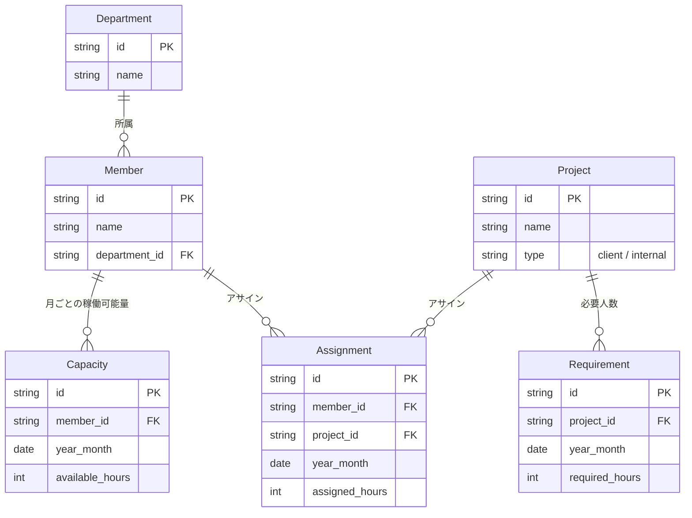
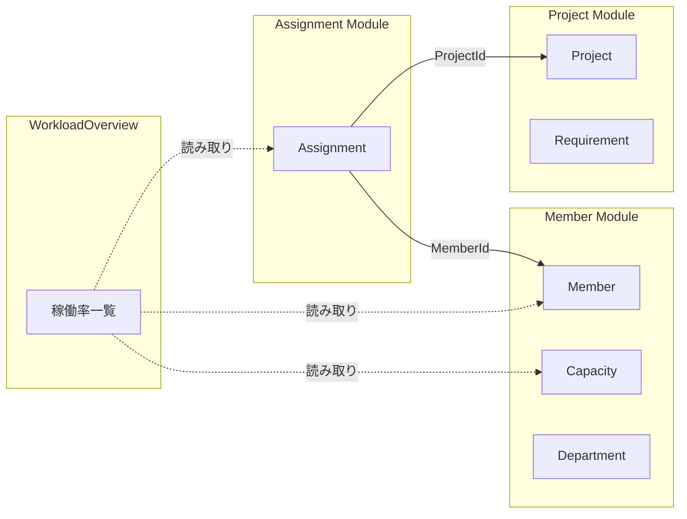

# ドメインモデル（稼働管理システム）

## モジュール構成

| モジュール | 含まれるドメイン | 説明 |
|-----------|----------------|------|
| **Member** | Member, Capacity, Department | 「人」に関する情報 |
| **Project** | Project, Requirement | 「案件」に関する情報 |
| **Assignment** | Assignment | Member と Project をつなぐ |
| **WorkloadOverview** | （複合モジュール） | 稼働率一覧（読み取り専用） |

---

## ER 図（Mermaid）

---

## モジュール間の関係（シンプル版）

---

## 記事で使える説明

### Member モジュール
- **Member**: 社員情報（名前、所属部署など）
- **Capacity**: 月ごとの稼働可能時間（稼働率計算の分母）
- **Department**: 部署（KPI 集計の単位）

### Project モジュール
- **Project**: 案件情報（クライアントワーク / 社内プロジェクト）
- **Requirement**: 案件ごとの必要人数・時間（「あと何人足りない」の計算用）

### Assignment モジュール
- **Assignment**: メンバーのプロジェクトへのアサイン
- Member と Project を「つなぐ」独立した概念
- アサイン・解除のライフサイクルが Member や Project とは別

### WorkloadOverview（複合モジュール）
- Member + Capacity + Assignment を横断して稼働率を計算
- **Domain 層を持たない**（読み取り専用）
- 他モジュールの Snapshot を組み合わせて返す

