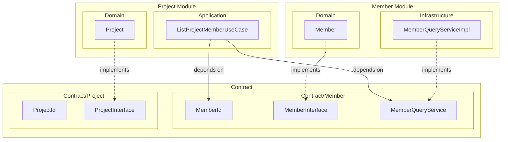

# モジュールとは

## 一言で

モジュールとは，関連するドメインをまとめた「境界」です．

なんちゃってクリーンアーキテクチャでは `app/UseCases/Post/` のようにディレクトリを分けていましたが，
これはあくまで「名前」で分けているだけで，実際には境界が存在しません．

モジュール分割では，各モジュールが独立して開発・変更できる単位となり，
他のモジュールとは明確なインターフェース（**Contract**）を通じてのみ通信します．

---

## なんちゃってとの違い

| | なんちゃって | モジュール分割 |
|---|-------------|--------------|
| ディレクトリ | `app/UseCases/Post/` | `modules/Member/` |
| 境界 | 暗黙的（ディレクトリ名だけ） | 明示的（Contract で定義） |
| 依存関係 | どこからでも参照可能 | Contract 経由のみ |
| 静的検証 | なし | deptrac で検証可能 |

---

## モジュールの種類

### 基本モジュール（CRUD を持つ）

Member, Project, Assignment のように，**独立したライフサイクル**を持つドメインを管理するモジュール．

- 自身の Entity を作成・更新・削除できる
- Contract に公開 API（ID, Interface, QueryService）を持つ
- 他のモジュールからは Contract 経由でのみアクセスされる

### 複合モジュール（読み取り専用）

WorkloadOverview, PeopleSearch のように，**複数モジュールを横断**して情報を集約するモジュール．

- 読み取り専用（他モジュールの Entity を作成・更新しない）
- 複数モジュールの Contract に依存する
- **自身の Contract を持たない**（他のモジュールから参照されない）

---

## モジュールを切る判断基準

すべてを別モジュールにする必要はありません．
以下のような判断基準でモジュールを切るかどうかを検討します．

### 1. 独立したライフサイクルを持つか？

- Member の作成/削除と Project の作成/削除は独立している → 別モジュール
- Capacity は Member と強く結びついている → Member モジュール内に含める

### 2. 関心事が独立しているか？

- Member と Project は別の関心事 → 別モジュール
- Member と Department は近いが、Department は組織構造という別の関心事 → 分けてもいい
- Capacity は Member に強く依存 → Member モジュール内に配置

### 3. ドメインを越境した JOIN が必要か？

- 複数ドメインをまたぐ検索は、各モジュールの QueryService を順番に呼ぶと非効率
- → 読み取り専用の複合モジュールとして切り出し、越境 JOIN を許容する
- 例: PeopleSearch は Member + Assignment + Project を JOIN して効率的に検索

**記事では注意書きを入れる：**

```markdown
:::message alert
モジュール境界を越えた JOIN は、依存関係が複雑になり変更の影響範囲が広がります．
ここではパフォーマンスを優先した妥協として、読み取り専用に限定して許容しています．

なんちゃってクリーンアーキテクチャでも，取捨選択の中で厳格なクリーンアーキテクチャでは禁忌とされる形を採用していました．
こういう形の崩し，ときには大事．
:::
```

---

## メリット

この「境界を明示する」ことで，以下のメリットが得られます：

- **変更の影響範囲が明確になる**: モジュールの内部実装を変えても，Contract を変えなければ他に影響しない
- **静的検証が可能になる**: deptrac などのツールで依存関係の違反を CI で検出できる
- **チーム分割がしやすくなる**: モジュールごとに担当チームを分けられる
- **AI Agent との協働がしやすくなる**: 最初に Contract さえ決めれば，モジュールの実装を並行して進められる

---

## 記事での書き方（案）

```markdown
## モジュールとは

モジュールとは，関連するドメインをまとめた「境界」です．

なんちゃってクリーンアーキテクチャでは `app/UseCases/Post/` のようにディレクトリを分けていましたが，
これはあくまで「名前」で分けているだけで，実際には境界が存在しません．

モジュール分割では，各モジュールが独立して開発・変更できる単位となり，
他のモジュールとは明確なインターフェース（**Contract**）を通じてのみ通信します．

### モジュールの種類

| 種類 | 例 | 特徴 |
|-----|-----|------|
| **基本モジュール** | Member, Project | CRUD を実装。Contract に公開 API を持つ |
| **複合モジュール** | WorkloadOverview | 読み取り専用。複数モジュールを横断。Contract を持たない |

### モジュールを切る判断基準

すべてを別モジュールにする必要はありません．以下のような基準で判断します：

- **独立したライフサイクルを持つか？** → Member と Project は別モジュール
- **別のチームが担当しうるか？** → 担当が分かれるなら分割
- **変更の頻度やタイミングが違うか？** → マスタ系と日常オペレーションで分割
- **複雑さを隠蔽したいか？** → 横断的な検索は複合モジュールへ

### メリット

- **変更の影響範囲が明確になる**: 内部実装を変えても Contract を変えなければ影響しない
- **静的検証が可能になる**: deptrac で依存違反を CI で検出
- **AI Agent との協働がしやすくなる**: Contract を先に決めれば並行実装が可能
```

---

## 図（任意）



- **実線（→）**: 依存（depends on）
- **点線（-.->）**: 実装（implements）

### ポイント

- `ListProjectMemberUseCase` は Project Module 内にある
- しかし、Member のデータを取得するために `MemberQueryService` に依存
- **Contract 経由でのみ他モジュールにアクセス**できる

### 図の説明

1. **Contract/Member** に公開 API を配置
   - `MemberId`: 型安全な ID
   - `MemberInterface`: Entity の読み取り専用 Interface（PHP 8.4 Property Hooks）
   - `MemberQueryService`: 読み取り専用サービスの Interface

2. **Project Module の Application** が Contract を参照
   - `MemberId` を使ってメンバーを特定
   - `MemberQueryService` を DI して `MemberInterface` を取得

3. **Member Module の Infrastructure** が Contract を実装
   - `MemberQueryServiceImpl` が `MemberQueryService` を実装

4. **Member Module の Domain** が Entity を実装
   - `Member` が `MemberInterface` を実装

### Snapshot が不要な理由

PHP 8.4 の Property Hooks を使えば、Interface で読み取り専用契約を定義できる：

```php
interface MemberInterface
{
    public MemberId $id { get; }
    public string $name { get; }
}
```

Entity がこの Interface を実装すれば、他モジュールは Entity を直接受け取っても読み取りしかできない。
わざわざ Snapshot（DTO）に変換する必要がなくなる。

