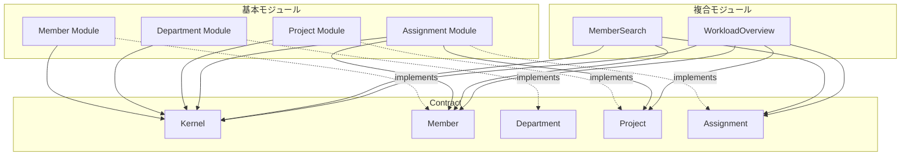

# 今回のアプリケーションにおけるモジュール分割

## モジュール一覧

| モジュール | 種類 | 含まれるドメイン | 備考 |
|-----------|------|-----------------|------|
| Member | 基本 | Member, Capacity | メンバー管理。稼働可能量も一緒に |
| Department | 基本 | Department | 組織構造。Member とは別の関心事 |
| Project | 基本 | Project, Requirement | プロジェクト管理。必要人数も一緒に |
| Assignment | 基本 | Assignment | アサイン管理。Member と Project をつなぐ |
| MemberSearch | 複合 | - | 複雑な条件でメンバーを検索 |
| WorkloadOverview | 複合 | - | 稼働率の集計・可視化 |

---

## ディレクトリ構造（モジュールレベル）

```
modules/
├── Contract/           # 公開 API
│   ├── Kernel/         # SharedKernel（全モジュール共通）
│   ├── Member/
│   ├── Department/
│   ├── Project/
│   └── Assignment/
│
├── Member/             # 基本モジュール
├── Department/         # 基本モジュール
├── Project/            # 基本モジュール
├── Assignment/         # 基本モジュール
│
├── MemberSearch/       # 複合モジュール（Contract なし）
└── WorkloadOverview/   # 複合モジュール（Contract なし）
```

---

## Mermaid 図（Contract と Module の関係）



---

## 記事での書き方（案）

```markdown
## 今回のアプリケーションにおけるモジュール分割

想定アプリケーションを以下のようにモジュール分割しました．

| モジュール | 種類 | 含まれるドメイン |
|-----------|------|-----------------|
| Member | 基本 | Member, Capacity |
| Department | 基本 | Department |
| Project | 基本 | Project, Requirement |
| Assignment | 基本 | Assignment |
| MemberSearch | 複合 | - |

（mermaid 図）

- **基本モジュール**は自身の Contract を持ち，他モジュールから参照される
- **複合モジュール**は Contract を持たず，他モジュールの Contract に依存するだけ
- すべてのモジュールは **Kernel**（SharedKernel）に依存する
```

